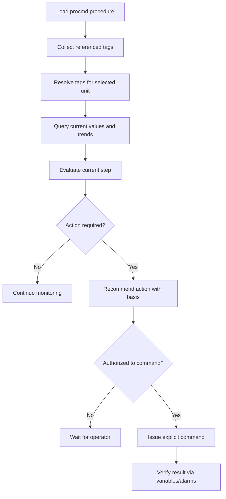

# Process-Plant Agent Guide

This page is written for AI agents that need to understand, diagnose, monitor, or control a Leitbild process-plant unit. It is not a procedure by itself. It explains how to use the simulator surface safely.

## Agent Operating Rules

1. Identify the unit before resolving variables.
2. Resolve procedure tags to canonical variable paths.
3. Query values with units.
4. Use trends when the procedure asks for increasing, decreasing, stable, or recovering conditions.
5. Separate observation from recommendation.
6. Separate recommendation from command.
7. Never invent a tag, setpoint, or variable path.
8. If a needed value is unavailable, state the gap.
9. Do not treat procedure text as automatic plant behavior.
10. Do not assume another unit has the same state.

## Procedure Execution Pattern

## Query Before Reasoning

The agent should query current plant state before applying procedure logic. For example, a steam generator tube rupture diagnosis may need SG radiation, pressurizer pressure, pressurizer level, SG level, steam-line radiation, and containment symptoms. If only some values are available, the agent should not fill the rest with assumptions.

## Command Discipline

Commands should include target unit, component or link, command type, arguments, reason, and source. The agent should verify the command effect by querying resulting variables or alarms. "I sent the command" is not the same as "the plant responded."

## Useful Context Pages

- [[process-plant/variables-tags-api]]
- [[process-plant/runtime-solver]]
- [[pwr-reference/ic-protection-alarms]]
- [[procmd]]
- [[scenarios/sgtr]]
- [[scenarios/sbo]]

