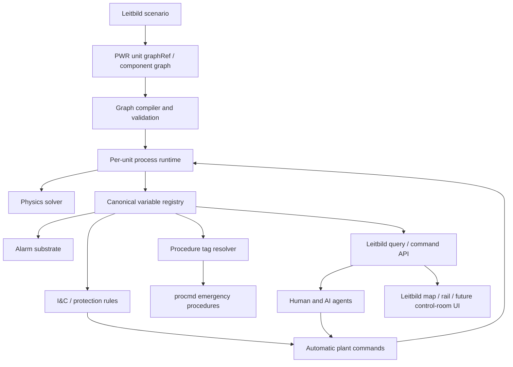

# Leitbild PWR Reference Handbook

This wiki is the operating, modeling, and AI-agent reference for the PWR plant simulated inside Leitbild. It keeps the emergency procedure corpus, but the center of gravity is now the **Leitbild PWR**: a configurable process-plant simulation with a component graph, medium-fidelity physics, I&C/protection behavior, alarm logic, canonical variables, procedure tag bindings, scenarios, validation traces, and API-facing guidance for human and AI operators.

> ⚠️ **Research and simulation reference, not licensed plant guidance.**
> The procedures and plant descriptions are reconstructed for simulation and AI-research use. They are not plant-specific licensed operating procedures.

## What This Wiki Is For

The wiki should answer four practical questions:

1. **What plant is Leitbild simulating?**
   The PWR reference model, its systems, components, links, variables, physics depth, I&C, alarms, and known limitations.

2. **How is the plant built?**
   The scenario-defined component graph, graphRef pattern, link model, variable registry, tag resolver, runtime loop, telemetry, and validation harness.

3. **How should humans and AI agents operate it?**
   Procedure lookup, tag resolution, variable querying, alarm interpretation, command discipline, uncertainty handling, and procedure-vs-automation boundaries.

4. **How can the model be extended?**
   Component-library rules, graph authoring, physics maturity expectations, validation patterns, and mirrored Leitbild ADR/source material.

## The Leitbild PWR In One Diagram

The plant is not hardcoded as one monolithic simulator. Leitbild instantiates process units from scenario definitions or graph references. Each unit owns its own component state, variable registry, alarm state, I&C state, telemetry, and command surface. Multi-unit scenarios are composed from multiple independent unit instances.

## Read This First

- [[start-here]] explains how humans, AI agents, and coding agents should navigate the wiki.
- [[pwr-reference/index]] describes the PWR reference plant and what it can currently simulate.
- [[pwr-reference/systems-modeled]] explains the major modeled plant systems.
- [[pwr-reference/physics-model]] explains the fidelity target and physical approximations.
- [[pwr-reference/ic-protection-alarms]] explains automatic protection and alarms.
- [[process-plant/scenario-and-graph-spec]] explains how the PWR is defined through Leitbild scenarios and graphRefs.
- [[process-plant/variables-tags-api]] explains canonical variable paths, tags, and AI-agent queries.
- [[agent-guides/process-plant-agents]] explains how an AI agent should interact with the plant.
- [[procmd]] explains the procedure markdown format used by the emergency procedure corpus.

## Procedure Corpus

The procedure pages remain an important part of the wiki. They encode emergency operating procedure structure in Procedure Markdown (`procmd`), including step graphs, branches, conditions, tag appendices, and cross-procedure transitions.

The procedures are not the simulator. They are operational guidance that an operator or AI agent can traverse while querying the simulated plant. Automatic reactor trip, safety injection, alarms, and other plant behavior belong to the I&C/protection and alarm substrates, not to the procedure markdown itself.

## Coverage Snapshot

The procedure corpus includes the E, ECA, ES, and FR families. The model reference covers the PWR systems currently represented in Leitbild, including RCS, core/vessel, pressurizer, steam generators, main steam, turbine/condenser, feedwater, auxiliary feedwater, CVCS, ECCS/accumulators, electrical systems, containment, I&C/protection, and alarms.

The current simulation target is **medium-fidelity operational behavior**: strong enough for scenario reasoning, AI-agent procedure support, and control-room-style research; intentionally simpler than plant safety-analysis tools.

## Source Truth And Mirroring

The Leitbild application repository remains canonical for executable code, ADRs, validation artifacts, and scenario definitions. This wiki mirrors selected Leitbild source docs under [[reference/leitbild-source-docs]] so agents can use the wiki as a current reference without relying on hand-copied architecture notes.

When mirrored content is stale, update the Leitbild source first and rerun the sync script in this wiki repository.
