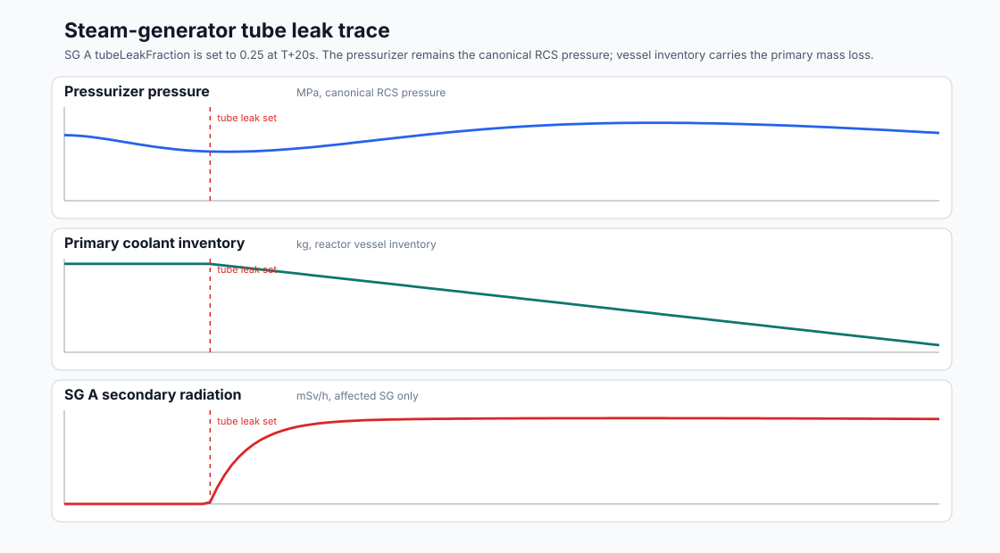
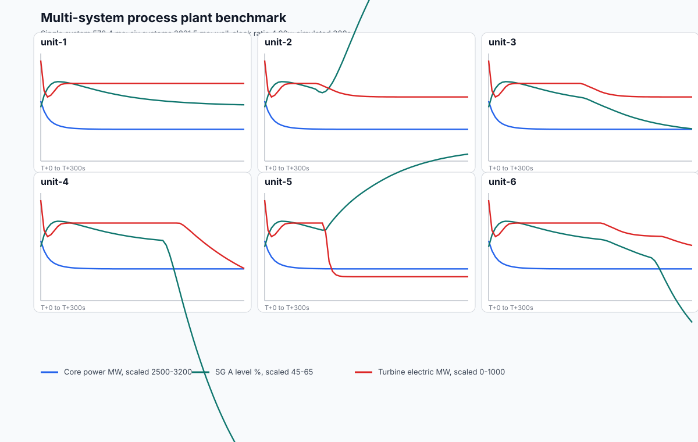
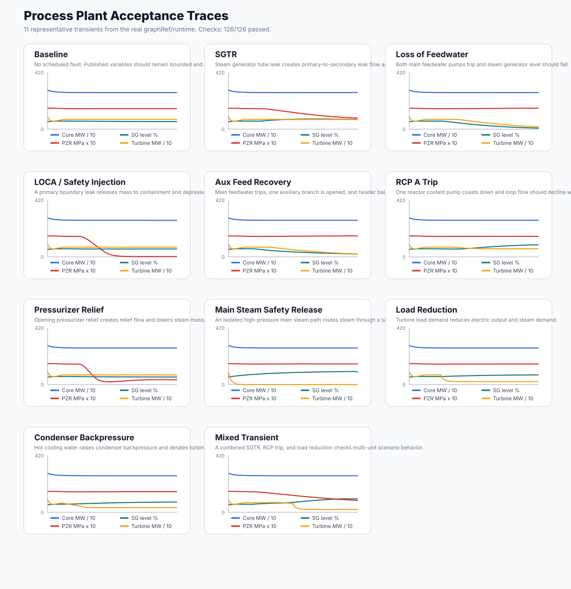

> This page is mirrored from `docs/process-plant-simulation-v1.md` in the Leitbild application repository.
> Do not edit it here. Update the source file and run `bun scripts/sync-leitbild-sources.ts`.

# Process Plant Simulation V1 Design Spec

## Purpose

Leitbild should be able to host process-control simulations that interact with the wider operational world. The first feasibility target is a pressurized water reactor plant, but the pack identity is deliberately broader: `process-plant`.

V1 is not a licensing-grade thermal-hydraulic analysis code. It is a medium-fidelity process-control simulator intended to test whether Leitbild can run, inspect, control, and coordinate coupled plant models credibly enough for control-room workflow research, AI-agent studies, and cross-domain scenario interaction.

The key feasibility question is whether a scenario-owned component graph, typed ports/links, a compiled runtime graph, and a fixed-step solver can make plant evolution understandable, efficient, replayable, and extensible.

## Core Decision

Process plant simulations live inside the `process-plant` pack. Leitbild core remains use-case agnostic.

The architectural decision is recorded in [ADR 0017](../adrs/0017-process-plant-component-graph.md).

Inside the pack:

- `PlantGraphSpec` describes plant topology and parameters as validated data.
- component definitions declare parameters, ports, variables, and later solver behavior.
- a graph compiler validates raw specs and compiles them into indexed runtime graphs.
- a fixed-step headless runtime owns continuous process evolution.
- a variable registry exposes stable paths, units, writability, and publish policy.
- connections can act as process links with optional physical metadata and link-local variables.
- discrete events represent commands, trips, alarms, threshold crossings, and scenario injections.
- pack queries expose read-only process state through Leitbild's generic query surface after provider lifecycle integration exists.

Leitbild core sees selected operational objects, commands, queries, events, and surfaces. It does not see every internal plant variable as an `OperationalObject`.

## Operational Projection Into Leitbild

Process systems may be represented in Leitbild by a small operational object facade. The facade lets a process plant appear on the map and in the rail alongside ambulances, hospitals, incidents, traffic, and weather, without turning the process runtime into a pile of operational objects.

Scenario object example:

```json
{
  "pack": "process-plant",
  "type": "unit",
  "id": "plant:halden-a2",
  "label": "Halden Unit A2",
  "systemId": "halden-unit-a2",
  "clusterId": "cluster-a",
  "coolingWater": "Tista river / Halden harbor",
  "location": [11.3744, 59.1206]
}
```

The process-plant provider owns the runtime and I&C state for `systemId`. On each provider tick it derives a projection for the operational object:

- status tone and label from active alarm/trip lifecycle state
- active alarm and trip counts
- summary power/output text
- selected fields for map/rail/hover surfaces
- updated operational status and priority for generic UI coloring

The projection is intentionally narrow. It is enough for shared operational awareness and AI overview, but it is not a second process store. Detailed values remain available through process-plant pack queries such as `process-plant.signals.read`, `process-plant.ic.status`, and `process-plant.alarms.status`.

## Scenario-Owned Process Assembly

The full plant run is assembled from a Leitbild Scenario Definition. The scenario declares active packs and may include one or more `processSystems`. Each process system names the owning pack, the component library, and a graph data object.

```json
{
  "processSystems": [
    {
      "id": "plant",
      "pack": "process-plant",
      "componentLibrary": "process-plant",
      "graphRef": "process-plant.pressurized-water-reactor.v1",
      "parameters": {
        "core": {
          "ratedPowerMw": 2890
        }
      },
      "initialState": {
        "core.rodInsertionFraction": 0.18,
        "sgA.secondaryInventoryKg": 60000
      }
    }
  ]
}
```

`graphRef` points to a pack-owned graph catalog entry. Use it when a scenario wants to instantiate an existing validated graph one or many times. A process system may alternatively provide an inline `graph` object for a fully scenario-authored topology. It must define exactly one of `graph` or `graphRef`; unknown refs fail before runtime.

Per-system `parameters` and `initialState` configure an instance without changing topology. `parameters` overlays component parameter objects before graph compilation. `initialState` sets declared runtime variable values before the first solver tick. `initialState` is initialization, not an operator command, so it can set declared state variables that are read-only during runtime. Runtime commands and scheduled process actions still require writable variables.

This keeps plant topology config-owned rather than hardcoded in TypeScript while avoiding huge repeated graph blobs in common scenarios. A future AI agent can either instantiate a known graph by ref or author a complete plant graph as scenario/config data, then Leitbild validates and compiles it before runtime. Do not patch topology through `parameters` or `initialState`; use a different `graphRef` or inline `graph` when topology must change.

The reusable machinery remains code-owned:

- component type definitions,
- parameter/state schemas,
- graph compiler,
- solver/runtime,
- provider query surface,
- command/event handlers.

That boundary is deliberate. Scenarios instantiate components and connect them; they do not invent arbitrary physics in V1.

## Canonical Graph Format

V1 uses JSON-compatible graph data as the canonical runtime input. The current built-in pressurized water reactor graph lives at `src/packs/process-plant/specs/pressurized-water-reactor.graph.json` and is exposed to scenarios as `graphRef: "process-plant.pressurized-water-reactor.v1"`.

A TypeScript data-builder DSL remains available as an authoring and test helper. The builder is not the runtime source of truth. Runtime plant assembly should load graph data from the Scenario Definition or from a graph data file referenced by scenario tooling.

Mermaid is documentation/debug output only. It is not the canonical plant model.

## Plant Graph Spec

The graph spec contains:

- `schemaVersion`
- `id`
- `title`
- `timestep`
- `components`
- `connections`
- `publishedVariables`

Component instance:

```ts
interface ComponentInstanceSpec {
  readonly id: ComponentId
  readonly kind: ComponentKind
  readonly label: string
  readonly parameters: unknown
  readonly initialState?: unknown
  readonly variables?: ReadonlyArray<ComponentVariableBindingOverride>
}
```

`variables` is a per-instance metadata overlay for component variables declared by the component kind. It is the right place for plant-specific procedure tags such as `PT-455` on `pressurizer.pressureMPa` or `SG-A-LVL-NR` on `sgA.levelPercent`. Component definitions remain reusable and do not hardcode plant-specific tag names.

Connection:

```ts
interface ConnectionSpec {
  readonly id: ConnectionId
  readonly from: PortRef
  readonly to: PortRef
  readonly connectionKind: ConnectionKind
  readonly service?: ConnectionService
  readonly nominalFluid?: FluidKind
  readonly designPhase?: DesignPhase
  readonly solverModel?: FluidSolverModel
  readonly physical?: ConnectionPhysicalSpec
  readonly variables?: ReadonlyArray<ProcessLinkVariableDescriptor>
}
```

Raw port refs use a compact authoring form such as `sgA.primaryOutlet`. Runtime code must not repeatedly parse these refs during every tick. They are parsed and resolved once by the compiler.

## Process Links

A connection is also the place to model simple conduit-local behavior. In a process plant this often corresponds to piping, a duct, a cable, a bus, a shaft, or a signal wire. V1 calls this a **Process Link**.

The important design choice is that a link can stay visually and conceptually simple while still exposing useful process variables. A connection has a structural `connectionKind`, and fluid connections add a `service` such as `primaryCoolant`, `mainSteam`, `feedwater`, `auxFeedwater`, `condensate`, `charging`, or `letdown`. The service is the stable operational grouping; `nominalFluid`, `designPhase`, and `solverModel` describe the expected design condition without pretending that the fluid can never change phase.

For example, a main steam line can remain one graph connection from a steam generator to its isolation valve while the same link owns:

- flow sensor value,
- pressure sensor value,
- radiation monitor value,
- leak area.

That avoids graph explosion. A simple sensor or leak does not need to become a node sandwiched between two pipe segments when it only observes or modifies one connection. Valves are different: `processValve` and `steamValve` are first-class components because they own stroke timing, effective position, controller response, relief/safety auto-open behavior, and flow diagnostics.

Example:

```json
{
  "id": "sg-a-steam-to-msiv-a",
  "from": "sgA.steamOutlet",
  "to": "mainSteamIsolationValveA.inlet",
  "connectionKind": "fluidFlow",
  "service": "mainSteam",
  "nominalFluid": "steam",
  "designPhase": "steam",
  "solverModel": "compressibleSteam",
  "physical": {
    "lengthM": 38,
    "diameterM": 0.72,
    "volumeM3": 15.5,
    "nominalResistance": 0.08
  },
  "variables": [
    {
      "path": "flowKgPerS",
      "label": "Main steam flow",
      "kind": "derived",
      "domain": "hydraulic",
      "writable": false,
      "publish": "telemetry",
      "quantity": "flowRate",
      "unit": "kg/s",
      "initialValue": 0,
      "tagId": "FT-SG-A-001",
      "equipmentId": "sgA",
      "description": "Main steam flow from steam generator A"
    },
    {
      "path": "leak.areaFraction",
      "label": "Main steam line leak area",
      "kind": "control",
      "domain": "hydraulic",
      "writable": true,
      "publish": "telemetry",
      "quantity": "ratio",
      "unit": "fraction",
      "initialValue": 0,
      "equipmentId": "sgA",
      "description": "Connection-local leak opening on the main steam line"
    }
  ]
}
```

Compiled link variables use stable paths just like component variables:

- `sg-a-steam-to-msiv-a.flowKgPerS`
- `sg-a-steam-to-msiv-a.pressureMPa`
- `sg-a-steam-to-msiv-a.radiationMSvPerH`
- `sg-a-steam-to-msiv-a.leak.areaFraction`

Use a link variable when the state only observes or modifies one connection. Use a component when the item has multiple ports, significant internal dynamics, separate failure modes, or needs to appear as a major plant object in control-room displays.

## Process Signal Bindings

Process signal bindings are the bridge between compiled process variables and procedure/operator/AI language. They are graph-owned metadata, not a second data store.

Every process signal resolves to:

```text
{ controlRunId, systemId, variablePath }
```

`systemId` is always explicit. Leitbild does not assume a current unit or a fleet of identical plants. A tag such as `PT-455` can exist in several independent systems; API calls disambiguate by `systemId`.

Variable descriptors may declare:

```ts
interface ProcessSignalMetadata {
  readonly tagId?: string
  readonly equipmentId?: string
  readonly description?: string
  readonly externalRefs?: ReadonlyArray<string>
  readonly capabilities?: ProcessVariableCapabilities
  readonly limits?: ProcessVariableLimits
}
```

`tagId` replaces the old `sensorId`/`actuatorId` split. A signal is readable or writable according to the variable's compiled capabilities, which are derived from the descriptor's `writable`, `publish`, and `tagId` fields unless explicitly overridden. This prevents two parallel naming systems from drifting apart.

Compiled variable capabilities are:

```ts
interface ProcessVariableCapabilities {
  readonly readable: boolean
  readonly writable: boolean
  readonly trendable: boolean
  readonly alarmable: boolean
  readonly operatorFacing: boolean
  readonly aiVisible: boolean
  readonly procedureRelevant: boolean
}
```

Capabilities are metadata, not a second access-control system. The runtime still enforces writes through `writable` and value validation. The compiler rejects a `tagId` that is made invisible to operators, AI agents, and procedures because such a tag would be discoverable only by accident.

Variable limits are optional:

```ts
interface ProcessVariableLimits {
  readonly normalRange?: { readonly min: number; readonly max: number }
  readonly operatingRange?: { readonly min: number; readonly max: number }
  readonly hardRange?: { readonly min: number; readonly max: number }
  readonly alarmLimits?: {
    readonly lowLow?: number
    readonly low?: number
    readonly high?: number
    readonly highHigh?: number
  }
}
```

`hardRange` is enforced by the runtime and rejects invalid commands or restored values. Normal, operating, and alarm limits are interpretation data for procedures, AI agents, UI, and future alarm/protection logic. Do not add arbitrary hard ranges to generic variables; use them only when the component design has a real bound, such as a fraction command from 0 to 1 or a declared equipment control limit.

Component variable tags are declared as per-component-instance metadata:

```json
{
  "id": "pressurizer",
  "kind": "pressurizer",
  "label": "Pressurizer",
  "parameters": {},
  "variables": [
    {
      "path": "pressureMPa",
      "tagId": "PT-455",
      "equipmentId": "pressurizer",
      "description": "Pressurizer pressure"
    }
  ]
}
```

Link variable tags are declared directly on the link variable because link variables are already graph-instance state:

```json
{
  "path": "pressureMPa",
  "tagId": "PT-SG-A-001",
  "equipmentId": "sgA",
  "description": "Main steam line A pressure"
}
```

The compiler validates:

- tag ids are unique inside one compiled process system
- component variable overlays reference real local variable paths
- tagged variables remain visible to operators, AI agents, or procedures
- numeric ranges are ordered
- writable commands only target variables whose descriptor declares `writable: true`
- numeric writes remain inside declared `hardRange` values
- API requests supply exactly one signal reference form, either `path` or `tagId`

External procedure systems may use a URI-like reference:

```text
process-plant://unit-1/pressurizer.pressureMPa
```

This is a stable external reference, not the primary runtime key. The runtime still resolves through `systemId` and `variablePath`.

## Pack Query And Command Surface

Process-plant exposes signal-aware read-only queries through the generic pack query endpoint.

Current process-plant signal query kinds:

- `process-plant.signals.resolve`: resolve signal references to metadata
- `process-plant.signals.read`: resolve signal references and return current variable snapshots
- `process-plant.signals.search`: search by text, tag, equipment, domain, quantity, writability, procedure relevance, and publish policy

Example procedure-agent read:

```json
{
  "packId": "process-plant",
  "kind": "process-plant.signals.read",
  "payload": {
    "systemId": "unit-1",
    "signals": [
      { "tagId": "PT-455" },
      { "tagId": "SG-A-LVL-NR" }
    ]
  }
}
```

Writable controls use the same signal reference shape through `process-plant.control.write`:

```json
{
  "kind": "process-plant.control.write",
  "payload": {
    "systemId": "unit-1",
    "tagId": "PORV-456A",
    "value": 1
  }
}
```

No process-specific HTTP endpoint family is introduced. The Control Instance API routes generic pack queries and command envelopes to the active process-plant provider.

## Cross-Pack Operational Demands

Process-plant does not directly call ambulance, traffic, weather, or any other pack. Cross-pack operational needs are expressed as interaction signals and committed effects.

The initial generic demand signal is:

```text
operational.demand.requested
```

Payload shape:

```json
{
  "schemaVersion": 1,
  "demandId": "halden-a2-medical-demand",
  "capability": "medical.transport",
  "sourceObjectId": "plant:halden-a2",
  "location": { "type": "Point", "coordinates": [11.3744, 59.1206] },
  "quantity": 2,
  "severity": "warning",
  "title": "Medical pickup requested at Unit A2",
  "description": "Plant Unit A2 requests medical transport for two people at the site access point."
}
```

Responder packs interpret capabilities they understand. The ambulance pack currently handles `medical.transport` by creating an incident target at the demand location and emitting an operational notification. The handler is idempotent by `demandId`, so replay or duplicate signal delivery does not create duplicate incidents.

This is the preferred V1 pattern for a plant unit needing external support. It keeps the source pack generic and lets future responder packs add capabilities without changing process-plant.

## Halden Process-Plant Multi-Sim Demo

`halden-process-plant-demo` is the first scenario that puts process-plant into the shared Leitbild world.

The scenario activates:

- `process-plant`
- `ambulance`
- `weather`

It instantiates six independent process systems from `graphRef: "process-plant.pressurized-water-reactor.v1"` in two nearby Halden clusters. Each unit has its own `systemId`, reference I&C config, runtime state, schedule, and operational projection object. Two units have scheduled process faults: one SGTR-like transient and one feedwater/loop degradation path. Other units continue normally.

The same scenario includes hospitals, incidents, ambulances already moving at startup, reserve ambulances, and a moving weather front. At 30 seconds the scenario emits `operational.demand.requested` from one plant unit. Ambulance handles that demand through the generic interaction layer by creating an incident target, not through a plant-specific ambulance hook.

This scenario is a composition test:

- six process runtimes run in parallel
- process unit map/rail state comes from runtime/I&C projection
- ambulance routing and arrivals continue independently
- weather continues through its own provider-backed H3 field
- scenario guidance and demand signals use runtime events, not UI-only hacks

## Control And Protection Substrate

Control/protection logic is deterministic pack-owned behavior, not scenario-authored code. It is the process-plant pack's simplified instrumentation-and-control substrate. The substrate sits above continuous physics: it observes the authoritative process variable table through signal bindings, interprets plant conditions, and emits constrained actions. It must not become a second physics solver, a hidden state store, or an embedded emergency procedure engine.

The substrate has six semantic layers:

- **Instrumentation signals**: process variables made visible through graph-owned signal bindings. Signals are the common read surface for displays, alarms, controllers, procedures, AI agents, and control-room surfaces.
- **Normal controllers**: routine automation such as pressure control, level control, flow control, pump speed control, valve positioning, heater/spray control, and turbine/load control. Controllers are observable and can only request writes through the runtime write queue.
- **Protection functions**: safety-like automatic logic such as trip, isolation, relief, safeguard actuation, or equipment trip. Protection functions may latch and may require explicit reset conditions.
- **Alarm/annunciator state**: persistent current state plus transition events. Alarm state answers "what alarms are active, acknowledged, cleared, latched, suppressed, or resettable right now?" Annunciator metadata gives UI/AI consumers stable grouping, equipment, priority, role, and first-out handles without parsing alarm prose. Transition events answer "what changed?"
- **Permissives and interlocks**: command/action constraints. A permissive must be true before an action can proceed. An interlock prevents, forces, or constrains an equipment state.
- **Validated actions**: alarm state transitions, trip state transitions, and queued writes to process signals.

External procedure runners remain outside process-plant for now. A procedure runner, operator, or AI agent can query signal values, search procedure-relevant signals, ask whether named conditions are true, and issue validated commands. The process-plant pack provides the signal and condition truth surface; the procedure system owns procedure documents, procedure branching, and procedure execution policy.

V1 rules read process signal snapshots, evaluate typed conditions, and produce constrained effects:

- `alarm.enter`: persistent alarm lifecycle state plus an alarm transition interaction signal
- `trip.enter`: persistent trip lifecycle state plus a trip transition interaction signal
- `writeSignal`: validated variable write queued for the next solver tick

The rule language supports:

- numeric/boolean comparison against a signal value
- `all`, `any`, and `not`
- simple voting
- optional `modeCondition`, which qualifies a rule against process state such as power operation, shutdown, post-trip state, or equipment availability without creating a separate mode store
- delay before actuation
- optional explicit `clearCondition` and `clearDelayMs` for alarm hysteresis and chatter control
- latching, reset-on-clear behavior, and explicit reset conditions

Definitions belong to one explicit process system. A reusable `graphRef` may provide default I&C definitions for its plant model, and a scenario or provider config may enable, disable, add, or parameterize definitions for a specific `systemId`. There is no implicit current unit, no cross-unit alarm namespace, and no fleet-wide protection state.

Runtime ordering is:

1. apply queued commands
2. run continuous physics solver phases
3. evaluate protection rules against the completed tick snapshot
4. queue any rule writes for the next tick
5. emit alarm/trip interaction signals
6. record telemetry

This keeps the process variable table as the only continuous-state truth. The interaction event bus is used for discrete operational awareness, not for continuous process physics.

Automatic actions from normal controllers and protection functions use the same validation semantics as operator, scenario, and AI commands: resolve a signal, check writability, validate type and hard limits, queue the write at a phase boundary, and make failure visible. An internal actor such as `actor:process-plant-protection` may request the action, but it does not get a private mutation path.

I&C definitions are semantically validated before the runtime starts. The provider rejects rule classes that do not match their effects: alarm rules may only enter alarms, protection rules may only enter trips or request validated writes, normal-control rules may only request validated writes, and permissive/interlock rules must declare command gates rather than lifecycle effects. Write effects and command gates are resolved against graph-owned signals during startup, and non-writable targets, impossible value types, or hard-range violations fail visibly.

Permissives and interlocks constrain the same command/write path used by operators, scenarios, AI agents, and automatic I&C writes. A command gate names the target signal it governs. A permissive blocks the write when its condition is false; an interlock blocks the write when its condition is true. Gates evaluate against the authoritative runtime snapshot at the current solver boundary, so recently accepted commands do not become visible until the fixed-step runtime applies them.

Implemented I&C provider config shape:

```json
{
  "systems": {
    "unit-1": {
      "protection": {
        "rules": [{
          "id": "pzr-high-pressure",
          "ruleClass": "protection",
          "condition": {
            "type": "comparison",
            "signal": { "tagId": "PT-455" },
            "operator": ">",
            "value": 16.2
          },
          "modeLabel": "power operation",
          "modeCondition": {
            "type": "comparison",
            "signal": { "path": "core.powerMw" },
            "operator": ">",
            "value": 100
          },
          "delayMs": 1000,
          "clearCondition": {
            "type": "comparison",
            "signal": { "tagId": "PT-455" },
            "operator": "<",
            "value": 15.9
          },
          "clearDelayMs": 1000,
          "latch": true,
          "effects": [{
            "type": "trip.enter",
            "id": "pzr-high-pressure-alarm",
            "title": "Pressurizer pressure high",
            "message": "Pressurizer pressure is above the high alarm threshold.",
            "severity": "critical",
            "annunciator": {
              "system": "reactor coolant system",
              "equipmentId": "pressurizer",
              "group": "pressurizer",
              "firstOutGroup": "pressurizer-pressure",
              "priority": "urgent",
              "role": "automaticAction"
            }
          }]
        }]
      }
    }
  }
}
```

The current lifecycle state is exposed by `process-plant.ic.status`. It returns rule snapshots, persistent alarm states, persistent trip states, structured annunciator metadata, and visible rule/effect failures. Alarm and trip lifecycles have an explicit `phase`: `normal`, `activeUnacknowledged`, `activeAcknowledged`, `clearedUnacknowledged`, `clearedAcknowledged`, `suppressed`, `shelved`, or `outOfService`. Lifecycle state also records occurrence, clear, acknowledgement, suppression, shelving, first-out, actor/client provenance, and transition timestamps.

`process-plant.ic.catalog` exposes the configured rules, watched signals, effects, command gates, mode labels, and annunciator metadata so control-room surfaces and AI agents can inspect what I&C behavior is installed. Lifecycle updates use the command `process-plant.ic.lifecycle`, with `systemId`, `lifecycleId`, an `action` of `acknowledge`, `reset`, `suppress`, `unsuppress`, `shelve`, or `unshelve`, and optional `reason` and `shelveDurationMs`. These actions update lifecycle state only and do not clear the underlying process condition.

Alarm-specific read surfaces are available through `process-plant.alarms.status`, `process-plant.alarms.summary`, and `process-plant.alarms.history`. They expose current alarm/trip state, grouped counts by severity/kind/role/group, first-out entries, and bounded lifecycle transition history. Lifecycle transitions also emit `interaction.signal` events with a `process-plant.alarm.*` or `process-plant.trip.*` signal type so live clients can update without polling. Procedure runners can ask condition truth through `process-plant.conditions.evaluate`, which uses the same typed condition schema as I&C rules and returns all signal reads used during evaluation.

Control-room surfaces, scenario tooling, and AI agents can dry-run an actuator write through `process-plant.control.validate`. It accepts the same payload shape as `process-plant.control.write`, resolves the same signal reference, checks writability, validates type and hard range, and evaluates the same permissive/interlock gates. It returns whether the write would be accepted at the current runtime snapshot and does not mutate plant state.

Procedure runners can also validate a procedure tag appendix through `process-plant.procedure-tags.validate`. The query accepts extracted tag records such as `{ id, simPath, units, equipment }`, resolves each tag against the compiled graph-owned signal bindings for one `systemId`, and reports `resolved`, `resolved-with-warnings`, or `missing`. It is deliberately read-only compatibility checking for external procedure documents; it does not parse procmd, execute procedure steps, own branch state, or create a second simulator-binding catalog.

## Fluid Link Solver Contracts

Fluid process links must declare `nominalFluid`, `designPhase`, and `solverModel`. These fields are not decorative labels. The graph compiler validates them as a contract before runtime starts.

Current solver models:

- `sourceSink`: a bounded source/sink conduit for simple supply or drain paths. It currently requires `designPhase: "liquid"` and link-local `flowKgPerS` and `temperatureC`.
- `incompressibleLiquid`: a liquid process link for feedwater, condensate, charging, letdown, auxiliary feedwater, and primary-coolant paths. It requires `designPhase: "liquid"` and `flowKgPerS` plus `temperatureC`. Primary-coolant links additionally require `pressureMPa` and `pressureDropMPa`, because they publish propagated RCS pressure read-outs.
- `compressibleSteam`: a steam process link for main steam and exhaust steam paths. It requires `designPhase: "steam"` and `flowKgPerS` plus `temperatureC`. Pressure, quality, void fraction, enthalpy, radiation, and leak area are optional link-local variables when that connection needs them.
- `twoPhaseApprox`: a limited transitional model for paths that are intentionally represented as mixed-phase in V1, such as pressurizer relief. It requires `designPhase: "twoPhase"` and `flowKgPerS` plus `temperatureC`.

The purpose of the contract is to stop accidental graph drift as the component library grows. If a scenario or graph file declares a fluid connection without the variables needed by its solver model, compilation fails before a runtime exists. The runtime therefore does not need silent fallbacks such as "if pressure is missing, invent one".

`solverModel` is intentionally still a lumped-model contract, not a full numerical method declaration. For example, `incompressibleLiquid` does not mean Leitbild is solving a full hydraulic network. It means the link participates in the current liquid flow/temperature/pressure-drop behavior and must provide the state surfaces that behavior expects.

## Typed Ports And Process Links

Component definitions declare named ports with a kind and direction.

Port kinds:

- `hydraulic`
- `thermal`
- `hydraulicThermal`
- `steam`
- `electricalAc`
- `mechanicalShaft`
- `controlSignal`
- `logicSignal`

Port directions:

- `in`
- `out`
- `bidirectional`

Link kinds:

- `fluidFlow`
- `thermalContact`
- `electricalPower`
- `mechanicalTorque`
- `controlSignal`
- `logicSignal`

Typed ports are part of the graph. They prevent impossible topology and determine which solver pass owns a connection. For example, a hydraulic pump outlet can connect to a pipe inlet, but an electrical breaker output cannot connect directly to a hydraulic pump inlet. Connection services are not inferred from free-text labels; they are explicit authoring metadata validated by the graph schema.

## Current Component Library

The current component library defines graph interfaces, variables, parameter schemas, and runtime behavior-bearing components. Components should expose variables or reconciliation behavior; pure topology-only components are avoided because they make the graph look richer than the executable model.

- `reactorCore`
- `reactorVessel`
- `steamGenerator`
- `centrifugalPump`
- `processHeader`
- `steamHeader`
- `processTank`
- `processValve`
- `steamValve`
- `pressurizer`
- `turbineLoadSink`
- `condenserSink`

These names avoid temporary fidelity labels. Solver behavior is only added when it is real and tested; a component that only exists to make a diagram look complete should be left out until it has an executable purpose.

Reactor coolant pumps may declare a `primaryLoopId`. That marks the pump as the authoritative flow state owner for one primary loop. The process-system compiler validates that each declared primary loop has one pump inlet, one pump outlet, one core-to-steam-generator hot leg, and one pump-to-core cold leg before runtime starts. Primary-coolant links on that loop then read the pump's loop-flow state instead of independently inventing flow. This is intentionally still a lumped loop model, not a pressure-network solver, but pump trips now coast loop flow down over time instead of collapsing it instantly.

Primary pressure and primary inventory are deliberately separated but coupled. The pressurizer remains the canonical owner of RCS pressure in the current PWR graph; the reactor vessel owns total primary coolant inventory, inventory deviation, and the resulting pressure bias. Charging, normal letdown balance, relief flow, and steam-generator tube leakage change the vessel inventory. The pressurizer then reads the vessel pressure bias when it updates `pressurizer.pressureMPa`. This avoids two competing primary pressure truths while still allowing loss-of-inventory transients to depress pressure.

Steam generators now expose explicit tube-leak state. `tubeLeakFraction` is a writable fault/control variable; `primaryToSecondaryLeakKgPerS` is computed from the primary-to-secondary pressure difference; `secondaryRadiationMSvPerH` tracks the radiological indication on the affected secondary side. Main-steam radiation links read the source steam generator radiation, so an SGTR-like fault raises the affected steam-line radiation without contaminating unaffected steam generators.

## Graph Compiler

Raw specs compile once before runtime.

Compilation steps:

1. Validate the raw schema.
2. Reject duplicate component ids and connection ids.
3. Resolve component kinds through the component registry.
4. Validate parameters using the component definition.
5. Parse port refs.
6. Validate referenced components and ports.
7. Validate port compatibility and direction.
8. Validate the declared connection kind against typed ports.
9. Validate published variables against compiled component and process-link variables.
10. Build indexed component and link tables.
11. Group links by connection kind, component adjacency, and fluid service.
12. Produce a compiled variable registry.

Invalid topology fails before simulation starts with explicit diagnostics. There should be no silent fallbacks.

## Runtime Graph

The compiled graph uses numeric indices, not string lookups in hot loops.

```ts
interface CompiledPlantGraph {
  readonly specId: PlantGraphId
  readonly components: ReadonlyArray<CompiledComponent>
  readonly componentIndexById: ReadonlyMap<ComponentId, number>
  readonly links: ReadonlyArray<CompiledProcessLink>
  readonly linksByKind: Readonly<Record<ConnectionKind, ReadonlyArray<number>>>
  readonly incomingLinksByComponent: ReadonlyArray<ReadonlyArray<number>>
  readonly outgoingLinksByComponent: ReadonlyArray<ReadonlyArray<number>>
  readonly linksByService: ReadonlyMap<ConnectionService, ReadonlyArray<number>>
  readonly variables: ReadonlyArray<CompiledVariable>
}
```

This keeps the future solver deterministic and efficient. The runtime does not reparse string port refs in hot loops. If profiling later shows the need, the indexed graph can move hot numeric state into typed arrays without redesigning the spec.

## Current Expanded Plant Model

The built-in graph now models a four-loop plant skeleton rather than a single-loop toy graph. It includes a core, vessel/pressurizer topology, four steam generators, four reactor coolant pumps, main feedwater pumps/header/control valves, auxiliary feedwater tank/pumps/header/valves, main steam isolation valves/header/turbine stop valve, turbine, generator, condenser, condensate pumps, charging, letdown, and volume-control tank.

The graph artifact [process-plant-expanded-graph.mmd](./assets/process-plant-expanded-graph.mmd) is generated from the compiled graph. The trend artifact [process-plant-expanded-trace.svg](./assets/process-plant-expanded-trace.svg) comes from a headless runtime run with an RCP A trip at T+120s and loss of both main feedwater pumps at T+240s.

## Variable Registry

Every meaningful process value has a stable variable path and metadata.

Variable descriptors include:

- `path`
- `label`
- `kind`
- `quantity`
- `unit`
- `domain`
- `writable`
- `publish`

Units are structured metadata, not free text. Current quantities and units are intentionally finite:

- `power`: `MW`
- `reactivity`: `pcm`
- `ratio`: `fraction` or `percent`
- `pressure`: `MPa` or `Pa`
- `pressureDelta`: `MPa`
- `flowRate`: `kg/s`
- `flowRateDelta`: `kg/s`
- `mass`: `kg`
- `massDelta`: `kg`
- `temperature`: `degC`
- `head`: `Pa`
- `boolean`: `boolean`
- `radiationDoseRate`: `mSv/h`

The runtime snapshots include both the display value and a canonical value for ratios. For example, `sgA.levelPercent` may publish `55` with unit `percent`, while its canonical value is `0.55`.

Publish policies:

- `internal`
- `telemetry`
- `alarm`
- `leitbild`

Example paths:

- `core.powerMw`
- `core.reactivityPcm`
- `sgA.levelPercent`
- `sgA.heatTransferMw`
- `sgA.steamFlowKgPerS`
- `mainFeedwaterPumpA.flowKgPerS`
- `feedwater-control-valve-a-to-sg-a.flowKgPerS`
- `turbine.electricMw`
- `condenser.condensateTemperatureC`
- `rcs-hot-leg-a.temperatureC`
- `sg-a-steam-to-msiv-a.flowKgPerS`
- `sg-a-steam-to-msiv-a.leak.areaFraction`

The registry is the shared language for process surfaces, AI agents, tests, trends, scenario scripts, and pack queries.

## Solver Boundary

Continuous physics is solver-owned. Discrete events are for operational changes.

Do not model continuous plant physics through component-to-component event messages such as "pump emitted water" or "steam generator received hot water." That creates order-dependent behavior and breaks physical coherence.

Instead:

- components expose ports and variables,
- the compiled graph owns process links,
- solver passes compute flows, transfers, inventories, and state changes,
- events are emitted only for discrete transitions.

Discrete event examples:

- operator command accepted,
- pump started or tripped,
- valve demand changed,
- reactor trip actuated,
- alarm entered or cleared,
- scenario fault injected,
- threshold crossed.

V1 should use a deterministic fixed-step solver. A 100 ms internal timestep is a reasonable first target, with lower-frequency telemetry publication.

## Runtime And Solver Phases

The current runtime is intentionally headless. It is created from a `CompiledProcessPlantSystem`, owns one variable table for component and link variables, accepts typed variable-write commands for writable variables, and advances only through fixed internal timesteps.

Runtime code is split by responsibility:

- `runtime.ts` is the fixed-step orchestrator and clock.
- `variable-table.ts` owns the slot-backed process variable table, queued variable-write commands, type/writability checks, and snapshots.
- `execution-plan.ts` compiles the graph and registered behavior definitions into per-phase invocation lists so the hot loop does not rediscover behavior applicability on every tick.
- `behavior-contract.ts` defines the constrained execution context used by solver behavior.
- `component-behaviors.ts` owns current component initialization and component solver behavior.
- `runtime/links/` owns conduit-local process-link behavior such as flow, leak modifiers, pressure, temperature, main-steam demand, radiation updates, and availability effects from downstream component valves.

This keeps the current implementation small without hiding data ownership. The runtime has one authoritative variable table; the behavior modules read and write through that table rather than carrying duplicate copies of plant state. Public APIs remain path-based for humans, AI agents, snapshots, telemetry, and commands, but runtime storage uses compiled variable slots internally.

Behavior modules do not receive the raw variable table directly. Each behavior runs through a `ProcessPlantBehaviorContext` for a single phase and component or process link. That context can read declared variables, but it may write only the local output variables declared by that behavior. Wrong-type writes, unknown paths, non-finite numbers, and writes outside the behavior's declared outputs fail loudly. This is intentionally simpler than a full plugin engine, but it gives the runtime a real contract before more plant components are added.

Each behavior also declares a human/audit-facing `reads` list beside its write list. This is intentionally metadata-first in the current pass: it makes dependencies visible in tests and reviews without prematurely building a full dependency scheduler. Reads should refer to connection services such as `primaryCoolant`, `feedwater`, or `mainSteam`, not old free-text medium labels.

When adding component or process-link behavior, use the runtime behavior API rather than scanning or mutating the graph directly. A new behavior should declare its solver phase, local read surface, local write surface, and update function. The execution-plan compiler expands that behavior once against the compiled graph, validates that declared write variables really exist, and then reuses the resulting invocation list on every tick. That means future behavior gets slot-backed storage, write validation, graph-restore checks, and fixed-step execution automatically as long as it stays inside the behavior contract.

Behavior authoring rules:

- keep continuous physics in behavior modules, not in Leitbild events or Control Instance object updates,
- declare every local output in `writes`; undeclared writes fail and unknown write variables fail during execution-plan compilation,
- use compiled graph indexes and adjacency maps such as `incomingLinksByComponent` and `outgoingLinksByComponent` instead of scanning all links in hot loops,
- cache only static graph-derived data; do not cache process values outside the authoritative variable table,
- do not add module-level mutable process state,
- prefer helper functions for repeated physical calculations, but avoid speculative component frameworks before a second concrete model needs them,
- add tests that cover both the behavior contract and the physical trend the behavior is meant to create.

The variable table rejects physically invalid writable values before they enter the queued command buffer and validates behavior writes before they reach storage. Generic guardrails currently include finite numbers, ratio bounds (`fraction` in `0..1`, `percent` in `0..100`), and non-negative values for flow, head, mass, power, pressure, and radiation dose rate. A full invariant scan is available as an explicit runtime/debug check, but normal runtime does not allocate full snapshots on every fixed step. This is not a substitute for detailed physics validation, but it prevents bad commands and behavior errors from quietly corrupting the process state without turning validation into the dominant workload.

The runtime phase order is explicit:

1. `applyCommands`
2. `updateControlLogic`
3. `solveFluidFlowComponents`
4. `solveFluidFlowLinks`
5. `solveThermalTransfer`
6. `solveElectrical`
7. `updateComponentState`
8. `updateProcessLinkState`

Publishing is not a hidden solver phase. After the fixed-step loop advances, the runtime returns the selected published variables from the authoritative variable table. Keeping publication as a read-out rather than a phase avoids implying that process state changes during telemetry extraction. Telemetry recorders resolve selected variable paths once and sample those variables directly; they do not snapshot the entire runtime just to read a few trends.

Runtime snapshots include the graph spec id and compiled variable path list. Restore rejects snapshots whose graph identity or variable layout no longer matches the compiled system, which prevents stale provider-private state from being applied to a different plant graph.

This follows the same broad lesson as serious simulator integrations such as FlyByWire: simulator bridges and user inputs should be outside the continuous model, while the model itself runs in a clear read/update/write rhythm. Continuous physics should not depend on incidental event order or browser update cadence.

Current runtime behavior is deliberately minimal but functional:

- reactor power responds gradually to rod insertion demand,
- reactor power now includes a simple negative temperature-feedback term from core outlet coolant temperature and fuel temperature. This is still point-reactor-like and simplified, but it prevents fission power from being purely rod-position driven.
- reactor heat is transferred into a primary coolant temperature rise using a shared lumped `Q = m * cp * dT` helper,
- core fuel temperature and decay heat are now explicit state variables, so reactor trips can leave residual heat removal demand after fission power falls,
- core coolant, steam generator primary/secondary temperatures, SG tube-metal temperature, SG level, turbine output, and condenser temperature now use explicit time constants rather than purely instantaneous jumps,
- pump flow follows running state and speed demand; pumps can optionally declare bounded response time/ramp limits without changing pumps that intentionally remain instantaneous,
- reactor coolant pumps can own `primaryLoopId` loop state with `loopFlowTargetKgPerS`, `loopFlowKgPerS`, and `developedHeadPa`; primary-coolant loop links read that loop state, so RCP trips produce loop-specific coastdown instead of instant global flow collapse,
- process links propagate simple flow and temperature values through primary coolant, feedwater, auxiliary feedwater, main steam, condensate, charging, letdown, and turbine-exhaust services,
- primary-coolant links may publish `pressureMPa`, which is propagated from the canonical pressurizer pressure rather than recomputed independently,
- steam generator heat transfer depends on `primaryCoolant` flow, tube-metal temperature, secondary temperature, level, and recirculation ratio,
- steam generator boiling rate and steam production are derived from heat transfer using a simple latent-heat approximation,
- steam generator secondary inventory is a bounded mass-balance state driven by feedwater and outgoing steam flow,
- steam generator tube leakage transfers primary coolant into secondary inventory and raises affected secondary/main-steam radiation,
- steam generator level, pressure, primary outlet temperature, tube-metal temperature, secondary temperature, feedwater inflow, boiling rate, and steam quality trend in response to feedwater, generated steam, turbine steam use, and primary-side heat input,
- turbine electrical output follows load, inlet steam flow, and available steam pressure,
- process tanks now carry inventory, level, temperature, makeup, and available outlet flow, so source tanks can be depleted or replenished instead of acting as infinite sources,
- condenser sink receives turbine exhaust steam and trends condensate temperature, back pressure, condensate production, condensate inventory, condensate level, and available condensate outlet flow,
- pump suction links are demand-limited by the destination pump flow, so stopped pumps do not drain source tanks or condenser inventory through passive link flow,
- pressurizer pressure, level, water inventory, water temperature, steam temperature, heater demand, spray demand, relief valve position, and relief flow are now explicit component variables,
- pressurizer steam mass is now explicit state rather than only a pressure display effect. Heaters create steam mass, spray condenses steam back into the water inventory, relief flow removes steam mass, and steam-mass deviation contributes to pressure response alongside level and primary-inventory pressure bias. This keeps mass accounting conservative while remaining a lumped two-region proxy rather than a full two-phase pressurizer model,
- link flow variables can be modified by link-local leak area and by downstream component valve availability,
- link radiation variables can respond to leak state.
- runtime invariants reject non-finite process values before they can become snapshots or telemetry.

The current thermophysical helpers live in `src/packs/process-plant/runtime/thermophysics.ts`. They are intentionally approximate and code-backed: specific heat, latent heat, water temperature rise from heat/flow, steam flow from heat, a pressure-to-saturation-temperature approximation, and a small energy-balance helper. Keep this shared helper layer thin. It should prevent duplicated constants and arithmetic drift without pretending to be RELAP, Modelica, or a steam-table package.

The runtime is connected through the process-plant simulation provider. The provider owns private runtime snapshots, exposes read-only process state through pack queries, and accepts writable-variable commands through the normal Control Instance command path.

## Feasibility Scenarios

V1 should prove the architecture against three scenario families.

Steam generator tube rupture-like transient:

- primary-to-secondary leak path through `steamGenerator.tubeLeakFraction`,
- primary pressure/inventory effect through vessel inventory and canonical pressurizer pressure,
- secondary inventory and radiation indications on the affected steam generator/main steam line,
- alarm/trip behavior,
- operator response variables.

The current headless SGTR trace sets `sgA.tubeLeakFraction` to `0.25` at T+20s and records the coupled response. The trace shows the intended V1 relationship: primary inventory falls, canonical pressurizer pressure trends below the no-leak baseline, and affected SG/main-steam radiation rises.



Generated SGTR artifacts:

- [process-plant-sgtr-trace.svg](./assets/process-plant-sgtr-trace.svg)
- [process-plant-sgtr-trace.csv](./assets/process-plant-sgtr-trace.csv)

Loss of feedwater:

- feedwater flow reduction or loss,
- steam generator level decrease,
- degraded heat removal,
- reactor/turbine trip logic,
- simplified auxiliary/emergency feedwater path.

Turbine trip/load rejection:

- steam demand change,
- secondary pressure response,
- reactor power/control response,
- protection/alarm response.

The initial target is credible process directionality and control-room usefulness, not nuclear-grade fidelity.

## Pack Surface

V1 should use the existing generic pack query route. Do not add `/api/process-plant/*` endpoint families without a new ADR.

Implemented queries:

- `process-plant.systems.list`
- `process-plant.graph.read`
- `process-plant.variables.read`
- `process-plant.variables.search`
- `process-plant.signals.resolve`
- `process-plant.signals.read`
- `process-plant.signals.search`
- `process-plant.conditions.evaluate`
- `process-plant.procedure-tags.validate`
- `process-plant.runtime.status`
- `process-plant.telemetry.published`
- `process-plant.trends.read`
- `process-plant.ic.status`
- `process-plant.ic.catalog`
- `process-plant.alarms.status`
- `process-plant.alarms.summary`
- `process-plant.alarms.history`

Implemented commands:

- `process-plant.control.write`
- `process-plant.ic.lifecycle`

Candidate future commands:

- `process-plant.control.operate`
- `process-plant.scenario.injectFault`

Implemented events:

- `process-plant.alarm.entered`
- `process-plant.alarm.cleared`
- `process-plant.alarm.acknowledged`
- `process-plant.trip.entered`
- `process-plant.trip.cleared`
- `process-plant.trip.acknowledged`

Candidate future events:

- `process-plant.operator.action`
- `process-plant.variable.thresholdCrossed`
- `process-plant.modeChanged`

The current implementation covers graph/spec validation, a headless fixed-step runtime and testbed, provider lifecycle integration, provider-private snapshot/restore, query routing, signal resolution/read/search, external condition evaluation, procedure tag compatibility validation, persistent I&C lifecycle state, validated I&C writes, command gates, and writable-variable command paths. Process-control UI surfaces remain a follow-up.

Process-plant provider config may also define pack-owned timed actions and telemetry sampling per process system. This is deliberately inside the pack boundary, not in core scenario scripting. Core knows that the process-plant provider has a private config object; the process-plant pack owns the meaning of timed pump trips, valve writes, rod movements, and trend retention.

Every provider-configured system key must match a declared process system id. Unknown keys are rejected before runtime starts. This keeps typoed multi-unit scenarios from silently running without the intended I&C, schedule, or telemetry configuration.

Reference I&C behavior is enabled explicitly with `icRef`. The first built-in reference is `process-plant.pressurized-water-reactor.ic.v1`, which is designed for the built-in `process-plant.pressurized-water-reactor.v1` graph. It is implemented as a small catalog assembled from family modules for pressurizer, steam-generator, reactor-coolant-pump, and balance-of-plant rules. It contributes normal pressure-band actions, protection-like reference actions, and alarm/trip annunciation for SGTR, loss of feedwater, RCP trip/coastdown, pressurizer pressure/level events, turbine/load reduction, and condenser backpressure.

Reusable controller behavior in the reference set is expressed through authoring helpers that expand into ordinary I&C rules. For example, the pressurizer pressure controller is generated as low-demand, high-demand, and normal-band rules that write heaters and spray through the same queued write path. The runtime still sees only the typed rule language; there is no separate controller interpreter.

`icRef` is not a procedure package. It must not encode emergency operating procedure steps, branching, diagnosis, or operator instructions. It only represents plant automation and annunciation: what automatic logic observes, what it actuates, and what alarm/trip state it exposes. External humans, control-room surfaces, procedure runners, and AI agents still own procedure execution by querying signal/condition truth and issuing explicit commands.

For now, a process system must choose either `icRef` or inline `protection`; defining both is rejected. This avoids hidden merge behavior. If a scenario needs custom I&C, either reference the built-in behavior or define the complete inline rule set for that system.

Example provider config:

```json
{
  "providerConfigs": {
    "process-plant": {
      "systems": {
        "unit-2": {
          "icRef": "process-plant.pressurized-water-reactor.ic.v1",
          "telemetry": {
            "sampleIntervalMs": 5000,
            "variables": ["core.powerMw", "sgA.levelPercent", "turbine.electricMw"]
          },
          "schedule": {
            "actions": [
              {
                "id": "unit-2-rcp-a-trip",
                "atMs": 60000,
                "type": "setVariable",
                "path": "rcpA.running",
                "value": false
              }
            ]
          }
        }
      }
    }
  }
}
```

## Persistence And Replay

The process plant provider owns private runtime state. It persists enough provider snapshot data to restore a running plant without replaying the scenario definition as if it were current state.

Persist:

- process system id,
- runtime elapsed time,
- fixed-step remainder,
- queued commands that have been accepted but not yet applied at a solver phase boundary,
- current process variable values,
- fired scheduled action ids,
- configured telemetry buffers when telemetry is enabled for the process system.

Future persistence additions:

- plant spec id/version or graph hash for stronger stale-state detection,
- active alarms,
- explicit long-run trend retention policy.

Do not persist every high-frequency telemetry frame into the durable journal. The durable journal remains meaningful accepted history. Provider snapshots hold current runtime truth.

Telemetry is opt-in and pack-owned. A process system without telemetry config still runs and can be queried for current variable snapshots. A process system with telemetry config records selected variables at the configured interval and exposes the samples through `process-plant.trends.read`.

## Performance Strategy

The performance strategy is architectural:

- compile graph once,
- use numeric component and port indices,
- group links by physical domain,
- use a fixed timestep,
- publish selected variables only,
- avoid parsing raw graph strings in the solver loop,
- add typed arrays only after profiling proves they are needed.

V1 acceptance should include a headless performance test for the first reactor graph. A useful target is simulating one hour of plant time faster than real time in headless mode, or maintaining stable real-time execution under expected UI query load.

The current multi-system benchmark runs six independent copies of the expanded four-loop plant graph for five minutes of simulated time, with different scheduled faults per system. Six is only a useful measurement fixture, not a design target. The same model should support arbitrary `n` systems and mixed graph refs, such as four systems using one graph ref and eight using another. The systems use `graphRef: "process-plant.pressurized-water-reactor.v1"` so the graph is catalog-resolved instead of repeated as six inline JSON objects. The benchmark records three selected variables per system and compares runtime with a single-system run on the current local machine.



Generated artifacts:

- [process-plant-six-unit-trace.svg](./assets/process-plant-six-unit-trace.svg)
- [process-plant-six-unit-trace.csv](./assets/process-plant-six-unit-trace.csv)
- [process-plant-six-unit-performance.json](./assets/process-plant-six-unit-performance.json)

Recent benchmark results on the current local hardware simulate five minutes of one system in roughly 0.22 seconds and five minutes of six systems in roughly 0.90 seconds, using median wall time over three measured runs after a warm-up run. That is roughly a 4.1x wall-clock penalty for 6x the plant count, and roughly 332x faster than real time for the six-system case at the current fidelity. The current graph has 44 components, 58 links, and 341 variables per system after adding primary inventory, primary pressure publication, and steam-generator tube-leak variables. The recent runtime refactor achieved this by keeping the public path-based model while moving hot-loop storage to variable slots, compiling per-phase behavior invocations once, sampling telemetry directly, using compiled adjacency indexes for link lookups, and removing full-snapshot invariant allocation from normal fixed-step execution. The physics-deepening passes have kept those optimizations: richer core, steam-generator, feedwater-pump, pressurizer, process-tank, condenser-inventory, primary-loop inertia, and primary-inventory/SGTR behavior added declared variables and arithmetic, not extra runtime graph scans or new orchestration layers.

Use `PROCESS_PLANT_BENCHMARK_WRITE_ARTIFACTS=false bun run process-plant:benchmark` when checking a deployed or remote machine. That mode prints the same performance JSON and machine metadata without rewriting documentation artifacts. Artifact-producing benchmark runs should be intentional because the SVG/CSV/JSON files are part of the repo documentation.

## Acceptance Evidence

The process-plant pack now has a compact acceptance trace harness:

```sh
bun run process-plant:acceptance
```

The harness compiles the real `process-plant.pressurized-water-reactor.v1` graphRef, runs six representative headless cases, records selected published variables, writes inspectable artifacts, and fails if high-level physical expectations are violated. It is deliberately not a second simulator. It uses the same graph compiler, fixed-step runtime, schedule runner, telemetry recorder, component behaviors, and process-link behaviors that provider-backed simulations use.

Current acceptance cases:

- baseline steady run,
- steam-generator tube rupture-like fault,
- loss of main feedwater,
- reactor coolant pump A trip/coastdown,
- pressurizer relief valve open,
- turbine/load reduction.

The checks are trend-level guardrails, not licensing-grade validation. They catch regressions such as missing SGTR leak/radiation coupling, feedwater loss not lowering steam-generator level, RCP trips collapsing instantly instead of coasting down, relief flow not removing pressurizer steam mass, or load reduction not lowering turbine output.



Generated artifacts:

- [process-plant-acceptance-traces.svg](./assets/process-plant-acceptance-traces.svg)
- [process-plant-acceptance-summary.json](./assets/process-plant-acceptance-summary.json)

The full per-sample CSV trace is intentionally not tracked because it is large and churns on every physics pass. Generate it locally only when a detailed trace investigation needs it:

```sh
PROCESS_PLANT_ACCEPTANCE_WRITE_CSV=1 bun run process-plant:acceptance
```

Acceptance plots are now part of the engineering loop for physics changes. When deepening a component or link behavior, add or adjust trend checks so the expected physical direction is visible and tested. Do not rely only on isolated variable assertions.

## Implementation Phases

Phase 1: graph/spec foundation:

- TypeScript data-builder DSL,
- Zod schemas,
- component registry,
- graph compiler,
- validation diagnostics,
- Mermaid generator,
- first pressurized water reactor graph spec,
- compiler tests.

Phase 2: runtime kernel:

- variable registry runtime,
- fixed-step solver phases,
- structured variable units,
- writable-variable command validation,
- headless process testbed.

Phase 3: minimal process slice:

- reactor core,
- primary loop,
- steam generator,
- feedwater source,
- turbine/load sink,
- condenser sink,
- simple control/protection logic.

The first coupled energy/flow path is now in place inside the headless runtime: reactor core, primary loop-flow inertia and temperature propagation, steam generator heat transfer, secondary boiling/quality/inventory response, bounded feedwater pump response, feedwater and auxiliary feedwater tank inventory, turbine load response, condenser sink behavior, and condensate inventory. The feedwater train now uses explicit pumps, headers, valves, tanks, and links in the graph. The condensate path has real production and inventory accounting, but it is still a simplified return path rather than a solved condensate/feedwater cycle with deaerator behavior, pump head curves, pressure losses, and controller dynamics. Protection logic, alarms, richer accident/fault injection, and first process-control surfaces also remain follow-up work.

Phase 4: emergency scenario tests:

- steam generator tube rupture-like transient,
- loss-of-feedwater transient,
- turbine trip/load rejection.

Phase 5: Leitbild integration:

- process plant pack registration,
- provider adapter,
- generic pack queries,
- commands,
- events,
- snapshot/restore.

Phase 6: first control-room surface:

- mimic display,
- alarm panel,
- trend panel,
- basic controls.

## Non-Goals For V1

- full plant fidelity,
- licensing-grade analysis,
- FMI/FMUs,
- multi-rate solvers,
- arbitrary user-authored equations,
- distributed solver execution,
- every variable as an operational object,
- Mermaid as canonical source,
- UI-first implementation before runtime feasibility.

## Guardrails

- Keep process-plant logic in `src/packs/process-plant/*`.
- Keep Leitbild core free of plant-specific terminology.
- Use TypeScript and Bun.
- Do not add JavaScript files.
- Do not add placeholder production paths.
- Fail loudly on invalid graph specs.
- Do not introduce a second HTTP server.
- Do not add domain-specific HTTP endpoint families.
- Do not blur continuous solver state with discrete events.
- Do not treat generated Mermaid diagrams as canonical topology.
