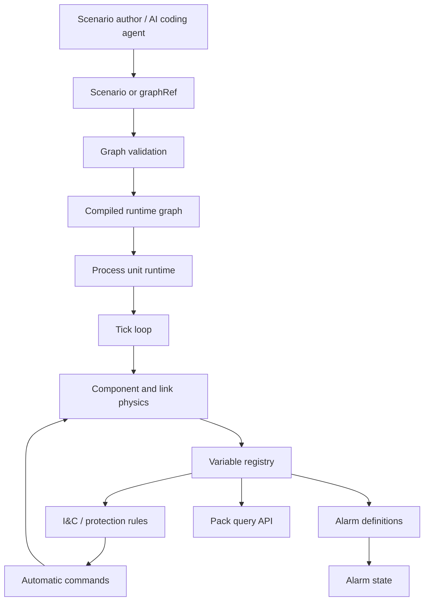

# Architecture Behind The Leitbild PWR

The Leitbild PWR architecture is built around one central claim: the plant should be authored as data, validated as a graph, and executed as a per-unit runtime. Code supplies reusable component behavior and solver mechanics. The scenario or graphRef supplies the actual PWR arrangement.

This allows Leitbild to run a compact PWR demonstration, a six-unit cluster, or a future PWR variant without adding new hardcoded runtime branches. The plant graph is the configuration surface; the runtime is the execution surface; variables, alarms, and commands are the operational surface.

## Layered Model

The validation and compile step is essential. The runtime should not spend each tick rediscovering graph shape, required parameters, missing variables, or link models. Expensive structural checks happen once when the unit is created. The tick loop then runs over a known, validated shape.

## Per-Unit Isolation

Every unit has its own graph instance, state, variable registry, alarm state, telemetry, and command surface. Multi-unit scenarios are composed from multiple unit instances. There is no fleet-wide shortcut inside the runtime. If a scenario instantiates six plants, that is six per-unit runtimes.

This matters for correctness. A fault in Unit A2 must not leak into Unit B1 because they happen to share a graphRef. Shared graph definitions are templates, not shared runtime state.

## Pack Interaction

The process-plant pack interacts with Leitbild through the same pack boundary as other packs. It can expose operational objects for the map and rail, answer pack queries, emit meaningful events, and accept commands. Other packs should not import process-plant internals. They should ask the pack for published variables or use Leitbild-level interaction surfaces.

For example, an ambulance pack does not need to know the internals of a reactor core. It needs an operational incident or pickup requirement. A weather pack does not need to mutate plant internals directly. It may provide environmental data that a plant scenario or future component can query or respond to through a defined surface.

## Automatic Behavior Versus Procedure Behavior

Automatic behavior belongs to I&C/protection rules. These rules read variables and issue configured plant actions. Examples include reactor trip on high neutron flux, safety injection on low pressurizer pressure, or pump trip on electrical bus loss.

Procedure behavior belongs outside the process runtime. A human or AI agent reads a procedure, queries variables, evaluates conditions, and decides whether to recommend or command an action. This prevents the simulator from becoming a hidden procedure engine and keeps emergency procedure logic inspectable in procmd.

## Source Of Truth Discipline

The executable model is the graph and runtime state. The wiki explains and mirrors it, but should not become a second source of executable truth. Generated catalogues and mirrored ADRs help keep the handbook current, but the runtime remains governed by the Leitbild code and scenario definitions.
