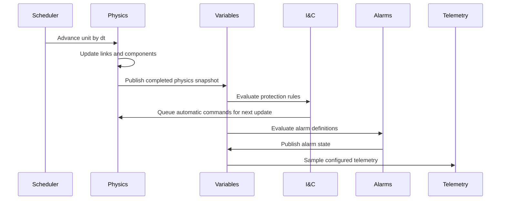

# Runtime And Solver

The runtime advances each process unit through repeated ticks. A tick should be deterministic, bounded, and easy to inspect. The runtime does not solve every plant phenomenon at once with a monolithic equation system. Instead, it uses a staged medium-fidelity update: component behaviors, link behavior, shared physics helpers, I&C/protection evaluation, alarm evaluation, and telemetry sampling.

## Tick Order

A typical tick follows this shape:

The important rule is that I&C and alarms read a completed physics snapshot. They do not mutate variables mid-solver. Commands produced by protection logic enter the normal command path.

## Physics Style

The solver uses lumped-parameter and first-order models. This is a practical middle ground. Components track inventories, temperatures, pressures, flows, pump speed, valve opening, steam mass proxies, and heat transfer terms. They use shared helpers for conservative balances, first-order lag, pump head/resistance, pressure response, saturation approximations, and bounded state updates.

This is intentionally not a full thermal-hydraulic network solver. It is deep enough to make major symptoms and trend directions coherent, but small enough to run many units quickly and remain understandable to agents and developers.

## Performance Model

Runtime performance depends mainly on:

- Number of units.
- Number of components per unit.
- Number of links per unit.
- Number of published variables.
- Number of I&C and alarm rules.
- Telemetry sampling volume.

The current architecture keeps per-unit loops explicit and avoids fleet-wide shortcuts. Benchmarks should continue to report realtime factor for single-unit and multi-unit runs. A value like `RT x100` means the simulation runs one hundred times faster than realtime for that validation workload.

## Restart And Snapshot Discipline

A process unit must restore from its own state without depending on another unit. Snapshot/restart tests should remain per-unit. Fleet-wide snapshots are a higher-level orchestration concern and should not creep into component or solver logic.

## Failure Surfacing

The runtime should fail visibly when a graph is invalid, a variable path cannot resolve, a tag is ambiguous, or a required component parameter is absent. Silent fallback is worse than a hard error because it lets an agent trust a plant state that was never actually modeled.

