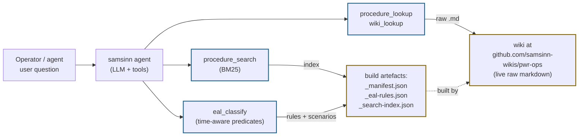

# samsinn integration

This wiki is consumed by two audiences. Human readers browse the
rendered MkDocs site at <https://samsinn-wikis.github.io/pwr-ops/>;
AI agents running inside **samsinn** ([github.com/michaelhil/samsinn](https://github.com/michaelhil/samsinn))
fetch the same source markdown live from GitHub and reason over it
through a small surface of agent-facing tools.

The wiki is **structured**, not prose. Every procedure is authored in
[procmd](procmd.md) — a markdown dialect where steps, branches,
checks, actions, cautions, decisions, and tag references are
first-class. That structure is what lets the samsinn tools below do
more than substring search.

## Tools

All tools live in the **pwr-ops samsinn pack** at
[`src/packs/pwr-ops/tools/`](https://github.com/michaelhil/samsinn/tree/master/src/packs/pwr-ops/tools).
They share a wiki-fetcher cache (5-minute TTL per process) and emit
one JSONL telemetry line per call so usage patterns can be studied.

### `procedure_lookup`

Fetches a procedure by id, parses the procmd source, and returns
either a paste-ready markdown rendering (default) or a structured
JSON object for agent reasoning.

[Source — `procedure-lookup.ts`](https://github.com/michaelhil/samsinn/blob/master/src/packs/pwr-ops/tools/procedure-lookup.ts)

**Sample prompts:**

- *"Walk me through E-0 step by step."*
  → Agent calls `procedure_lookup({ id: "E-0" })`, pastes the rendered
  markdown, then narrates each step in conversation.
- *"What does step `verify-ac-buses` in E-0 actually check?"*
  → `procedure_lookup({ id: "E-0", step: "verify-ac-buses" })` returns
  just that fragment with its Check / Action / Branches.
- *"Give me a structured representation of FR-S.1 — I want to reason
  about the branch graph."*
  → `procedure_lookup({ id: "FR-S.1", format: "json" })` returns
  `ParsedProcedure`: steps with parsed branches, tag references, and
  Because:/Against: rationales.

**Diagram generation** — when the agent renders a procedure in markdown
mode, the response includes a **mermaid flowchart** built from the
step graph. Decision steps with two or more substantive branches
render as diamonds; single-substantive-branch steps render as
rectangles; `free text:` branch targets render as distinct stadium-
shaped leaf nodes. Cross-procedure jumps appear as clickable nodes
that link to the referenced procedure's wiki page. This means an
agent can paste a procedure into a chat and the reader sees both the
prose and the flow at the same time.

### `wiki_lookup`

Fetches **non-procedure** reference pages — system descriptions, the
tag and setpoint catalogues, scenarios, EAL rule table, simulator
bindings, future operations and human-factors pages.

[Source — `wiki-lookup.ts`](https://github.com/michaelhil/samsinn/blob/master/src/packs/pwr-ops/tools/wiki-lookup.ts)

Page types are validated **against the live manifest at call time**,
not a hardcoded enum — so the wiki can publish new page types without
a samsinn release.

**Sample prompts:**

- *"What is the reactor coolant system?"*
  → `wiki_lookup({ type: "system-description", id: "rcs" })` returns
  the [RCS system page](systems/rcs.md) including the mermaid
  topology diagram (vessel ↔ hot legs ↔ steam generators ↔ cold legs
  ↔ RCPs ↔ pressurizer) and the pressurizer-pressure feedback control
  diagram.
- *"What does «PT-455» mean?"*
  → `wiki_lookup({ type: "tag-catalogue", id: "index" })` returns the
  [canonical tag catalogue](tags/index.md). Agent narrows to the
  relevant row.
- *"What's the Vogtle pressurizer SI setpoint?"*
  → `wiki_lookup({ type: "setpoint-catalogue", id: "index" })` returns
  the [setpoint catalogue](setpoints/index.md). 66 entries auto-
  aggregated from system pages.

### `procedure_search`

Symptom-driven BM25 ranking over a pre-built search index. The agent
passes free-text describing what's wrong; the tool returns up to 5
ranked procedures with score and matched-term explanation.

[Source — `procedure-search.ts`](https://github.com/michaelhil/samsinn/blob/master/src/packs/pwr-ops/tools/procedure-search.ts)

**Sample prompts:**

- *"Boron dilution alarm rising on shutdown."*
  → `procedure_search({ query: "boron dilution shutdown source-range" })`
  ranks [FR-S.2](procedures/FR-S.2.md) (Response to Loss of Core
  Shutdown) first.
- *"Subcooling margin dropping toward zero."*
  → ranks [E-1](procedures/E-1.md) and [FR-C.1](procedures/FR-C.1.md)
  near the top.
- *"Steam generator tube rupture symptoms."*
  → ranks [E-3](procedures/E-3.md) first.

#### What is BM25, and why?

[BM25](https://en.wikipedia.org/wiki/Okapi_BM25) is the classical
information-retrieval ranking function used in Lucene, Elasticsearch,
and every modern search engine. For each query term, it scores a
document by combining:

- **Term frequency** — how often the term appears in the document
  (more is better, with diminishing returns).
- **Inverse document frequency** — terms that appear in *few*
  documents are worth more than terms that appear everywhere.
- **Length normalisation** — long documents are penalised slightly so
  a quick-hit short procedure that explicitly mentions the symptom
  beats a long procedure that happens to use the term in passing.

The samsinn implementation uses standard parameters (*k₁* = 1.5,
*b* = 0.75), and the index is built at deploy time by
[`scripts/build-search-index.ts`](https://github.com/samsinn-wikis/pwr-ops/blob/main/scripts/build-search-index.ts).
The index document for each procedure is a flat tokenisation of its
frontmatter entry-triggers, monitored CSFs, every Check / Action /
Caution / Note line in every step, and every tag reference. Stopwords
(English + procmd-noise like "verify", "check") are filtered;
domain-specific words (subcooling, pressurizer, recirculation) are
kept as the signal.

Choosing BM25 over a custom heuristic was deliberate — BM25 is
parameterless from the author's point of view, well-understood, and
has decades of tuning behind it. There's no score-weight debate to
have.

### `eal_classify`

Classifies a scenario (or an ad-hoc plant state) against the
[NEI 99-01 EAL rule table](eal/classification-rules.md), returning
the highest emergency class reached (UE / Alert / SAE / GE), the
moment it was first triggered, and the matching IC code with its
citation.

[Source — `eal-classify.ts`](https://github.com/michaelhil/samsinn/blob/master/src/packs/pwr-ops/tools/eal-classify.ts)

**Sample prompts:**

- *"Classify the small-break LOCA scenario."*
  → `eal_classify({ scenarioId: "sb-loca" })` returns
  *"Unusual Event (SU4) at t = 30 s — pressurizer pressure below
  1815 psig. Source: NEI 99-01 SU4."*
- *"If both 4 kV emergency buses are dead for an hour, what's the
  EAL class?"*
  → `eal_classify({ initialState: { "BUS-A-EMERG": "DEAD",
  "BUS-B-EMERG": "DEAD" }, injections: [] })` with a custom evaluation
  horizon returns *Site Area Emergency (HS1)*.

The classifier is **time-aware**. EAL rules with `for >= <duration>`
clauses are evaluated against a projected time series of plant state
(initial state + injections sorted by `at-time-s`), with dwell
tracking that resets on any violating sample. NEI 99-01's persistence
rule — once a higher class is reached, it stays — is preserved by
returning the highest class reached anywhere in the timeline.

The rule table itself is [wiki-authored](eal/classification-rules.md)
markdown the wiki build pipeline emits as `_eal-rules.json`. The
samsinn tool fetches this JSON; the wiki is the source of truth.
Adding an EAL IC is a wiki edit, not a samsinn code change.

## Reasoning across procedures (not just substring search)

The procedure corpus is a **graph**, not a pile of text. samsinn agents
exploit this in several ways:

**Branch resolution.** Every procmd branch target is one of:
intra-page (`→ #step-id`), inter-page (`→ [[E-1]]` or
`→ [[E-1#start-hhsi]]`), or free-text (`→ free text: see SAMG entry
criteria`). The parser surfaces those as a typed `BranchTarget`; an
agent can therefore answer *"if step 4 fails in E-0, which procedure
do we enter?"* without reading the prose at all — the branch graph
is structured data.

**Tag-driven cross-reference.** Every `«TAG-ID»` reference in a
procedure resolves to a definition in that procedure's `## Tags`
appendix (sim-path, units, equipment, range, source citation). The
[canonical tag catalogue](tags/index.md) aggregates the *richest*
definition seen across all procedures; the [setpoint catalogue](setpoints/index.md)
aggregates the same data filtered for setpoint-bearing rows.
Validation rejects two procedures asserting *contradictory*
populated values for the same tag — a guardrail against hallucinated
setpoints in LLM-co-authored content. An agent asked *"what
procedures use the pressurizer pressure tag?"* can answer by reading
the catalogue, not by grepping every procedure.

**Decision-step semantics.** procmd v0.7's `Decision:` keyword
captures multi-path operator diagnostic choices with `Because:` and
`Against:` rationale tags on each branch. An agent comparing two
plausible diagnoses can quote the actual rationale the procedure
gives, not paraphrase it.

**CSF traceability.** Every procedure declares which Critical Safety
Functions it monitors and (often) which CSF-orange-path /
CSF-red-path it responds to. An agent triaging a multi-symptom
scenario can ask *"which procedures cover both the heat-sink and
RCS-inventory CSFs?"* and answer from frontmatter, not from prose.

**Scenario binding.** [Scenarios](scenarios/sb-loca.md) declare
initial plant state, injection schedules, expected procedure
traversal as `<procedure-id>#<step-id>` refs, and the
expected EAL class. The build-time validator runs `eal_classify`
against every scenario and rejects mismatches between the declared
class and the rule-table result. This catches both stale scenarios
and bogus rules.

## How the pieces fit together at runtime

samsinn caches each fetched resource for 5 minutes per process.
First call fetches live from `raw.githubusercontent.com`; if that
fails (rate limit, transient outage), the tool falls back to the
GitHub Pages site's mirror of the same artefact.

## Trying it out

The pwr-ops pack is bundled with samsinn — running any samsinn
instance with the pwr-ops pack enabled (default) gives an agent
access to all four tools.

For a quick end-to-end exercise:

1. *"Find the procedure for a steam generator tube rupture."*
   → BM25 returns E-3.
2. *"Fetch E-3 and show me the diagnostic flow."*
   → procedure_lookup pastes the procedure with its mermaid flowchart.
3. *"Walk me through the SGTR scenario and classify it."*
   → procedure_lookup + eal_classify together — paste the SGTR
   scenario, classify as Alert (SA5), and explain the IC that fired.

## See also

- [Procedure Markdown (procmd) spec](procmd.md) — the source format
  these tools consume.
- [Scope and disclaimers](scope.md) — what this wiki is and isn't.
- [Reference sources](sources.md) — Vogtle UFSAR, Tech Specs, NEI 99-01.
- [samsinn repository](https://github.com/michaelhil/samsinn) — the
  agent runtime + pwr-ops pack source.
