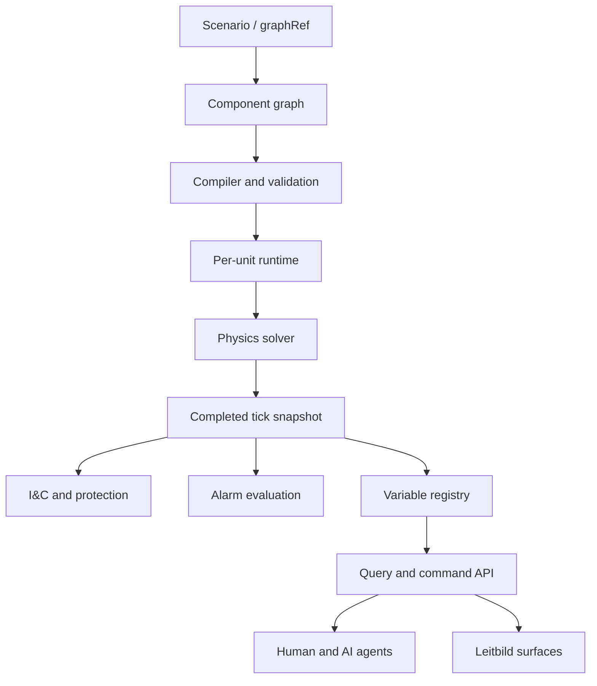

# Start Here

This wiki is the companion handbook for the PWR plant simulated in Leitbild. It serves three audiences at once: humans trying to understand the simulated plant, coding agents extending the PWR model, and operational AI agents that need to query plant state, resolve procedure tags, and recommend actions without inventing unavailable information.

The wiki is not a licensed operating manual and is not a substitute for plant-specific procedures. It is a research and development reference for a configurable simulator. The procedure pages remain useful because they encode realistic emergency-operations structure, but the simulator model, variables, components, alarms, and control actions are defined by the Leitbild process-plant pack and its scenario/component graph.

## How To Read This Wiki

For the PWR model itself, start with [[pwr-reference/index]], then [[pwr-reference/systems-modeled]], [[pwr-reference/components-modeled]], [[pwr-reference/physics-model]], and [[pwr-reference/ic-protection-alarms]]. These pages describe the plant Leitbild actually simulates today.

For how that PWR is built in Leitbild, read [[process-plant/index]], then [[process-plant/architecture]], [[process-plant/scenario-and-graph-spec]], [[process-plant/component-model]], [[process-plant/link-model]], and [[process-plant/runtime-solver]]. These pages explain the simulator machinery only insofar as it supports the PWR model.

For AI agents, start with [[agent-guides/process-plant-agents]] and [[process-plant/variables-tags-api]]. Those pages explain how to resolve procedure tags, query canonical variables, distinguish observations from commands, and avoid confusing plant automation with emergency procedure execution.

For procedure execution, start with [[procmd]], then the E-series and FR-series pages under [[index]]. Procedures are still central, but they should be understood as guidance and decision structure. They are not the automatic protection system, not the process solver, and not the source of plant physics.

## The Core Mental Model

The Leitbild PWR is a scenario-instantiated process plant. A graph reference describes each unit as components and links. The runtime validates and compiles that graph into per-unit simulation state. A solver advances physics each tick. A separate I&C/protection substrate reads the completed physics snapshot and may issue automatic plant actions. The alarm substrate evaluates configured alarm definitions against the resulting variable state. Operators and AI agents query canonical variables, resolve tags, inspect alarms, and send explicit commands through the API.

## What Is Canonical

The Leitbild application repository is canonical for executable code, scenarios, ADRs, and validation artifacts. This wiki is canonical as a companion handbook, agent reference, and procedure corpus. Pages under [[reference/leitbild-source-docs]] and `leitbild-source/` are mirrored from the application repository and should not be edited here.

The most important simulator truths are:

- The plant is built from scenario-defined or graphRef-defined component graphs.
- Each unit is independent. There is no hidden fleet-wide runtime.
- Components own physical state and behavior.
- Links describe physical and semantic connections between components.
- Variables and tags are the API surface for operators and agents.
- I&C/protection is automatic plant behavior.
- Procedures are external guidance for humans and agents.
- Alarms are generated from configured alarm definitions over runtime variables.

## Current Capability Level

The current Leitbild PWR targets medium-fidelity operational simulation. It is designed to support credible first-order behavior for SGTR, loss of feedwater, RCP trip/coastdown, pressurizer relief/spray/heater response, turbine/load transients, electrical degradation, CVCS effects, and multi-unit scenarios. It is not a RELAP-grade thermal-hydraulic solver and does not attempt licensed plant procedure fidelity.

The value of the model is not perfect physics. The value is that physics, I&C, alarms, procedures, AI agents, and other Leitbild packs can meet on a single well-typed simulation surface.
