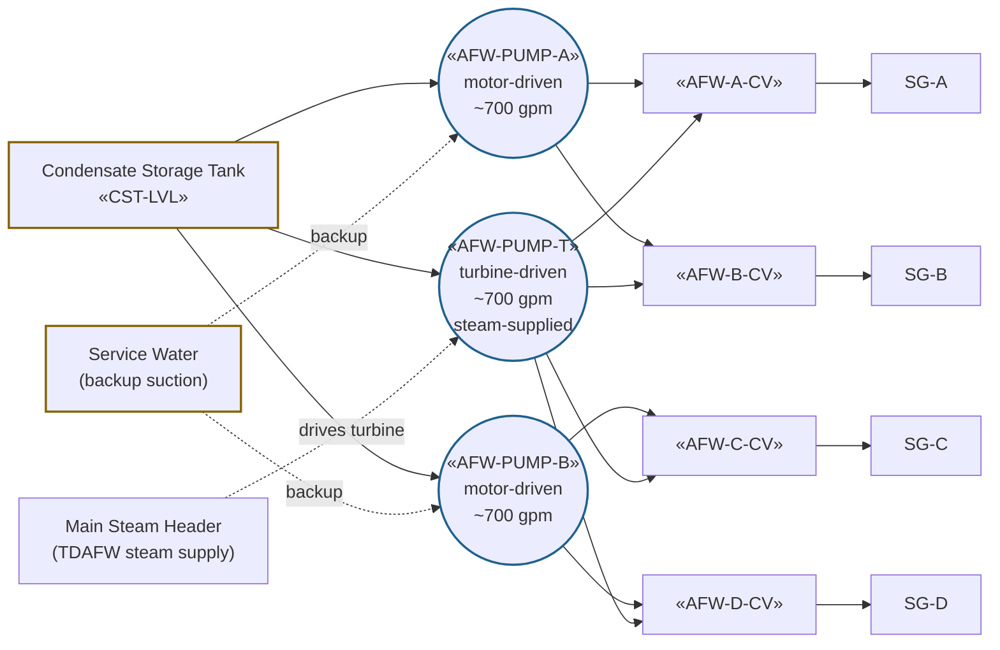

# Auxiliary Feedwater System (AFW)

The AFW system delivers feedwater to the steam generators after a
reactor trip when main feedwater is unavailable or insufficient. AFW
is the secondary-side equivalent of ECCS — it preserves the heat sink
during emergencies. The system is the only feedwater source under
station blackout (ECA-0.0) because the turbine-driven pump runs on SG
steam and DC controls.

## Function

Maintains SG inventory above the low-low setpoint following main
feedwater isolation, full-load rejection, or station blackout. Provides
the heat-removal path that lets RCS decay heat reach the atmosphere via
SG → MSL → condenser-or-ARV. AFW is also exercised during normal plant
startup and shutdown when feedwater pumps are not yet/no longer
sufficient.

Per Vogtle UFSAR §10.4.9 design-basis, AFW capacity is sized to remove
decay heat with a single pump operating (single-failure assumption).

## Components

- **Two motor-driven pumps** — «AFW-PUMP-A», «AFW-PUMP-B»; AC-powered
  from emergency 4kV buses; each can feed any two SGs at ~700 gpm.
- **One turbine-driven pump (TDAFW)** — «AFW-PUMP-T»; steam-driven from
  the main steam header (any unisolated SG); can feed all four SGs at
  ~700 gpm. Survives station blackout because DC controls only.
- **Four AFW control valves** — «AFW-A-CV»..«AFW-D-CV»; one per SG;
  air-operated, fail-open on loss of air.
- **Condensate storage tank (CST)** — «CST-LVL»; primary AFW suction
  source, ~300,000 gal usable.
- **Service-water cross-tie** — backup suction for the motor-driven
  pumps if CST exhausted.

## Instrumentation

- Pump statuses: «AFW-PUMP-A», «AFW-PUMP-B», «AFW-PUMP-T»
- TDAFW turbine speed: «TDAFW-SPEED»
- Aggregate AFW flow: «AFW-FLOW»
- Per-SG control-valve position: «AFW-A-CV», «AFW-B-CV», «AFW-C-CV», «AFW-D-CV»
- CST level: «CST-LVL»
- SG narrow-range levels (target indicator): «SG-A-LVL-NR» / «SG-B-LVL-NR» / «SG-C-LVL-NR» / «SG-D-LVL-NR»

## Setpoints

| Parameter | Value | Source |
|---|---|---|
| AFW auto-start (Low SG level on 2/4 SGs) | Low-low SG level «SG-A-LVL-NR» < ~17% NR | Vogtle Tech Spec 3.3.2 |
| AFW auto-start (other actuations) | SI signal, AMSAC ATWS mitigation, blackout | Vogtle UFSAR §10.4.9 |
| TDAFW minimum SG steam supply | ~150 psig (turbine min driving pressure) | Vogtle UFSAR §10.4.9 |
| CST minimum (Tech Spec LCO) | ~70% indicated (~200,000 gal usable) | Vogtle Tech Spec 3.7.6 |
| SG no-load level setpoint | ~50% NR | Vogtle UFSAR §10.3 |

## Normal alignment

- All three pumps standby; control valves throttled to balance AFW flow
  with main-feedwater control during low-power operations
- TDAFW steam-supply valves OPEN (turbine ready to receive steam on
  demand)
- CST level >70% (LCO compliance)
- AFW automatically actuates on SI, low-low SG level, or AMSAC ATWS
  signal

## Failure modes

- **Total loss of feedwater** — all AFW pumps unavailable AND main FW
  isolated. RED-path heat-sink response is [[FR-H.1]]; bleed-and-feed
  via PORVs and HHSI becomes the cooling method.
- **TDAFW failure during station blackout** — only available pump under
  SBO is the turbine-driven one; if that fails, [[ECA-0.0]] cannot
  maintain the heat sink and the response degrades into [[FR-H.1]] /
  [[FR-C.1]] territory.
- **SG overfeed by AFW** — AFW control valve stuck open or AFW pump
  speed governor failed. YELLOW-path response is [[FR-H.3]].
- **SG underfeed (low SG level despite AFW running)** — control valve
  stuck closed, pump trip during demand, CST suction loss. YELLOW-path
  response is [[FR-H.5]]; escalates to [[FR-H.1]] if total feedwater is
  lost.
- **CST depletion in extended event** — service-water cross-tie or
  alternate suction must be aligned per the plant's loss-of-feedwater
  procedures.

## References

- Vogtle UFSAR §10.4.9 (Auxiliary Feedwater System)
- Vogtle UFSAR §10.4.7 (Main feedwater — context for AFW interface)
- Vogtle UFSAR §15.2.7 (Loss of normal feedwater analysis)
- Vogtle Tech Spec 3.3.2 (AFW actuation logic)
- Vogtle Tech Spec 3.7.6 (CST level LCO)
- 10 CFR 50.62 (AMSAC ATWS mitigation requirements, drives AFW auto-actuation logic)
