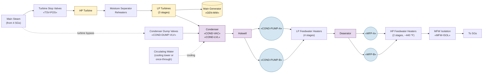

# Balance of Plant (BOP)

The balance-of-plant systems convert main-steam energy to electrical
output and return feedwater to the steam generators. From an EOP
perspective the BOP is relevant as the **normal heat sink** (turbine
+ condenser + main feedwater) whose loss drives the plant onto AFW
and on to the secondary-side heat-removal recovery procedures
([[E-0]], [[FR-H.1]]).

## Function

In normal operation: main-steam from the four SGs drives the HP and
LP turbines; exhaust steam condenses in the condenser against
circulating water; condensate is pumped through low-pressure heaters,
the deaerator, and the main feedwater pumps back to the SGs at ~440 °F
through high-pressure heaters.

In transient response: a turbine trip closes the turbine stop valves
and dumps steam to the condenser via the dump valves (if condenser
available); main feedwater isolates on SI; AFW takes over SG feed.
Loss of condenser vacuum forces atmospheric dumping via ARVs.

## Components

- **Main turbine** — tandem-compound HP + 3 LP stages; ~1180 MWe gross
  at Vogtle; moisture-separator-reheaters between HP and LP for
  saturated-steam cycle.
- **Main generator** — direct-coupled to turbine shaft; hydrogen-cooled
  stator; output to switchyard via main transformer.
- **Condenser** — multi-shell surface condenser; saturated steam
  condenses at ~3 in Hg abs (about 100 °F); circulating water cools
  the shell side.
- **Condenser steam dump valves** — bypass steam from main steam header
  directly to condenser; capacity sized for 100% load rejection at
  Vogtle (≈40% steam-flow dump).
- **Condensate pumps** — typically two, vertical multistage; pump
  hotwell condensate up through the LP feedwater heaters.
- **Deaerator** — strips dissolved oxygen from condensate; provides
  NPSH for main feedwater pumps; storage volume for transient flow
  mismatch.
- **Main feedwater pumps** — typically turbine-driven, two pumps; full
  flow on both; ~16000 gpm each at full load.
- **HP feedwater heaters** — final feed temperature ~440 °F; isolated
  on FWI signal (string check valves) to prevent heater-source
  inventory from flooding the SG.
- **Main feedwater isolation valves** — close on SI / FWI; AFW takes
  over SG feed via separate nozzles.

## Instrumentation

- Generator output: «GEN-MW»
- Turbine stop valve position: «TSV-POS»
- Condenser vacuum: «COND-VAC»
- Hotwell level: «COND-LVL»
- Condenser dump valve position: «COND-DUMP-VLV»
- Condensate pump statuses: «COND-PUMP-A», «COND-PUMP-B»
- MFW pump statuses: «MFP-A», «MFP-B»
- MFW isolation valve position: «MFW-ISOL»
- MFW flow per SG: «MFW-FLOW-SG-A»…D

## Setpoints

| Parameter | Value | Source |
|---|---|---|
| Rated thermal power | 3625 MWt | Vogtle UFSAR §1.3 |
| Gross electrical output | ~1180 MWe | Vogtle UFSAR §1.3 |
| Condenser design vacuum | ~3 in Hg abs (100 °F) | Vogtle UFSAR §10.4.1 |
| Condenser steam dump capacity | ~40% MS flow | Vogtle UFSAR §10.4.4 |
| MFW final feed temperature | ~440 °F | Vogtle UFSAR §10.4.7 |
| MFW isolation on SI | automatic | Vogtle UFSAR §10.4.7 |
| Loss-of-condenser-vacuum trip | «COND-VAC» < 22 in Hg | Vogtle Tech Spec 3.3.1 |

## Normal alignment

- Turbine on line at rated load; generator synced to grid
- Both condensate pumps and both MFW pumps in service
- Condenser dump valves closed; available on demand
- Deaerator at LCO storage level
- MFW isolation valves open; AFW pumps standby

## Failure modes

- **Loss of condenser vacuum** — sealing water failure, air in-
  leakage, CW loss. Turbine trips at «COND-VAC» < setpoint; steam
  dump unavailable; ARVs become the only steam-relief path. Cross-
  links to [[FR-H.1]] (heat sink threats).
- **MFW pump trip / both** — feed flow lost; AFW automatic actuation
  on low-low SG level. Response embedded in [[E-0]] / [[ES-0.1]].
- **Loss of circulating water** — cooling tower or intake failure;
  condenser pressure climbs; turbine trip via vacuum interlock.
- **Generator load rejection** — sudden grid disconnect; turbine
  overspeed protection trips; steam dump must handle full load
  rejection or SG safeties lift.
- **Feedwater heater string isolation** — HP heaters trip; feed temp
  drops, increasing reactor power demand; runback or trip may follow.

## Relationship to EOPs

BOP loss is the dominant initiator of secondary-side EOP entry:
turbine trip + MFW loss drives the plant to AFW heat removal. Most
recovery flows ([[FR-H.1]] / [[FR-H.2]] / [[FR-H.4]]) treat BOP
restoration as a long-term recovery path; the immediate EOP focus is
on AFW and steam-relief integrity rather than restoring the turbine
cycle.

## References

- Vogtle UFSAR §10.1 (Summary description — steam and power conversion)
- Vogtle UFSAR §10.2 (Turbine generator)
- Vogtle UFSAR §10.4.1 (Main condenser)
- Vogtle UFSAR §10.4.4 (Turbine bypass steam dump)
- Vogtle UFSAR §10.4.7 (Condensate and feedwater)
- Vogtle Tech Spec 3.3.1 (Reactor protection trip — vacuum)
