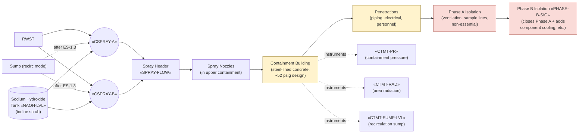

# Containment Building + Containment Spray

The containment is the steel-lined concrete structure that contains
the RCS, ECCS, RHR, pressurizer relief tank, and other systems
processing primary fluid. Its design-basis function is to retain
fission-product release inside the building during all design-basis
accidents. Containment spray reduces post-LOCA pressure by condensing
steam and scrubs iodine from the airborne phase via sodium-hydroxide
additive.

## Function

Provides the final fission-product barrier per defense-in-depth.
Withstands the design-basis containment pressure (~52 psig at Vogtle
per UFSAR §3.8.1) without leakage above the licensed value (≤ 0.20%
of containment air mass per day). Phase-A isolation closes
non-essential penetrations on accident signal; Phase B closes
additional penetrations + actuates spray on high-high containment
pressure.

## Components

- **Containment vessel** — steel-lined reinforced concrete; cylindrical
  with hemispherical dome; design pressure ~52 psig.
- **Two containment spray pumps** — «CSPRAY-A», «CSPRAY-B»; centrifugal;
  draw from RWST initially, switch to sump per [[ES-1.3]].
- **Spray header + nozzles** — array of nozzles in upper containment;
  spray cone covers most of the free volume.
- **Sodium hydroxide additive tank** — «NAOH-LVL»; chemical addition
  for iodine pH control during spray.
- **Phase A isolation valves** — close non-essential penetrations
  (ventilation, sample lines, instrument air, demin water).
- **Phase B isolation valves** — close additional penetrations
  including some component cooling, with safety functions preserved.
- **Containment penetrations** — piping (RHR, SI, charging,
  containment spray), electrical, instrument lines, personnel/equip
  hatches.

## Instrumentation

- Containment pressure: «CTMT-PR»
- Containment temperature: «CTMT-TEMP»
- Containment area radiation: «CTMT-RAD»
- Noble-gas activity: «CTMT-NG»
- Sump level: «CTMT-SUMP-LVL»
- Spray pump statuses: «CSPRAY-A», «CSPRAY-B»
- Spray header flow: «SPRAY-FLOW»
- Spray-additive tank level: «NAOH-LVL»
- Phase B isolation signal: «PHASE-B-SIG»

## Setpoints

| Parameter | Value | Source |
|---|---|---|
| Containment design pressure | ~52 psig | Vogtle UFSAR §3.8.1 |
| Phase B / spray actuation | «CTMT-PR» > 17 psig | Vogtle Tech Spec 3.3.2 |
| Containment leak-rate LCO (La) | 0.20 % / day | Vogtle Tech Spec 3.6.1 |
| Spray pump capacity (each) | ~3000 gpm | Vogtle UFSAR §6.2.2 |
| EAL Site Area Emergency thresholds | per NEI 99-01 (containment / radiation) | regulatory |

## Normal alignment

- Containment closed and pressurized to near atmospheric (slight
  vacuum or positive depending on ventilation alignment)
- All isolation valves in normal position; ready to close on accident
  signal
- Spray pumps standby, suction aligned to RWST
- Sodium hydroxide tank at LCO level

## Failure modes

- **High containment pressure (RED)** — design-basis LOCA inside
  containment + delayed spray. Response [[FR-Z.1]].
- **Containment flooding (ORANGE)** — sump fills past expected level.
  Response [[FR-Z.2]].
- **High containment radiation (YELLOW)** — fuel damage or large
  primary leak. Response [[FR-Z.3]]; EAL classification per
  NEI 99-01.
- **Sub-atmospheric containment after spray** — overcooling by spray
  exceeds heat source. Lesser hazard; spray modulation addresses.
- **Hydrogen accumulation** — post-Fukushima concern; from zirc-water
  reaction in core damage. Beyond design basis — bridges to SAMG.
- **Isolation valve failure to close on demand** — Phase A or Phase B
  signal received but mechanical/control failure; manual isolation
  required.

## References

- Vogtle UFSAR §6.2 (Containment systems)
- Vogtle UFSAR §6.2.2 (Containment heat removal — spray system)
- Vogtle UFSAR §3.8.1 (Containment structure)
- Vogtle Tech Spec 3.6 (Containment systems LCOs)
- NEI 99-01 (EAL methodology)
- post-Fukushima EA-12-049 (hydrogen control reviewed)
