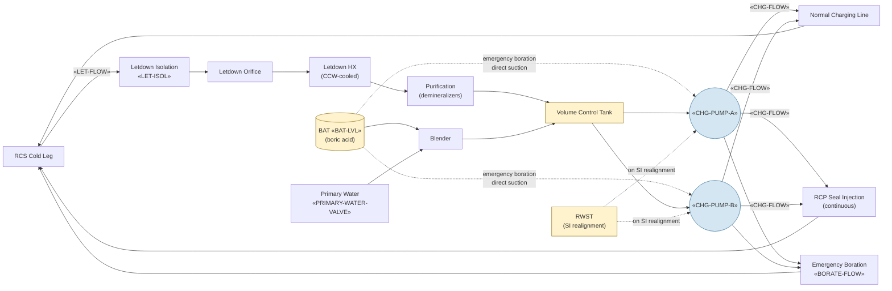

# Chemical and Volume Control System (CVCS)

CVCS performs four functions: (1) RCS volume control via charging /
letdown; (2) boron concentration control via boric-acid / primary-water
makeup blending; (3) RCP seal injection (continuous flow to RCP labyrinth
seals); (4) RCS chemistry control via the volume control tank.
Charging pumps are also part of the ECCS — they realign on SI to
inject from the RWST.

## Function

In normal operation: maintains pressurizer level via charging-letdown
balance (~75 gpm each direction); maintains RCS boron concentration
via blender (mixes boric acid from BAT and primary water from PWST
to setpoint).

In emergency operation: charging pumps realign on SI to take suction
from RWST and inject into the cold legs at high pressure. Emergency
boration alignment used in [[FR-S.1]] / [[FR-S.2]] aligns charging
to BAT-only suction for rapid shutdown-margin restoration.

## Components

- **Two charging pumps** — «CHG-PUMP-A», «CHG-PUMP-B»; positive-
  displacement; full normal flow on one pump, both required for SI
  alignment.
- **Boric acid tank (BAT)** — «BAT-LVL»; ~7000 gal at 4 wt% boric acid;
  heat-traced to keep above solubility line (~145 °F minimum).
- **Volume control tank (VCT)** — normal charging suction; absorbs RCS
  inventory excursions; hydrogen-blanketed for radiolytic-oxygen
  scavenging.
- **Letdown line** — three orifices in parallel (low / medium / high
  flow); letdown HX cooled by CCW; demineralizer beds for chemistry.
- **Primary-water makeup valve** — «PRIMARY-WATER-VALVE»; supplies
  unborated water to the blender for dilution; the FR-S.2 isolation
  target.

## Instrumentation

- Charging pump statuses: «CHG-PUMP-A», «CHG-PUMP-B»
- Charging flow: «CHG-FLOW»
- Letdown flow: «LET-FLOW»
- Letdown isolation valve: «LET-ISOL»
- Boric acid tank level: «BAT-LVL»
- Emergency boration flow: «BORATE-FLOW»
- Primary water makeup valve: «PRIMARY-WATER-VALVE»
- RCS boron concentration (sampled): «RCS-BORON»

## Setpoints

| Parameter | Value | Source |
|---|---|---|
| Normal charging flow | ~75 gpm (matched to letdown) | Vogtle UFSAR §9.3.4 |
| Charging pump capacity (each) | ~150 gpm at SI head | Vogtle UFSAR §9.3.4 |
| BAT minimum (cold shutdown reserve) | ~70% indicated | Vogtle Tech Spec 3.1.2 |
| BAT temperature minimum | 145 °F (4 wt% solubility) | Vogtle Tech Spec 3.1.2 |
| RCP seal injection flow (per pump) | ~8 gpm | Vogtle UFSAR §5.4.1 |
| Tech Spec boron for cold shutdown | 1800-2200 ppm cycle-dependent | Vogtle Tech Spec 3.1.1 |

## Normal alignment

- One charging pump in service, suction from VCT
- Letdown OPEN; flow path through orifice → HX → demineralizers → VCT
- Boric acid blended at setpoint; primary-water valve OPEN at low flow
- RCP seal injection flow established to all four RCPs

## Failure modes

- **Loss of charging** — both pumps tripped or VCT depleted. RCP seal
  cooling lost (5-10 min until seal degradation); pressurizer level
  drops if letdown still open.
- **Letdown isolation failure (stuck open)** — uncontrolled RCS
  inventory loss to VCT; pressurizer level drops; can challenge
  [[FR-I.2]].
- **Boron dilution accident** — primary-water-valve mis-position
  during makeup; rising source-range count rate; response [[FR-S.2]].
- **High-concentration boric acid precipitation** — BAT temperature
  drops below solubility line; boric-acid crystallization in charging
  line; emergency boration capability impaired.
- **VCT overpressure or hydrogen leak** — normal charging suction
  affected; cycle to alternate alignment.

## References

- Vogtle UFSAR §9.3.4 (Chemical and Volume Control System)
- Vogtle Tech Spec 3.1.1 (RCS boron concentration), 3.1.2 (BAT)
- Vogtle UFSAR §15.4.6 (Boron dilution analysis)
- Vogtle UFSAR §5.4.1 (RCP seal injection)
