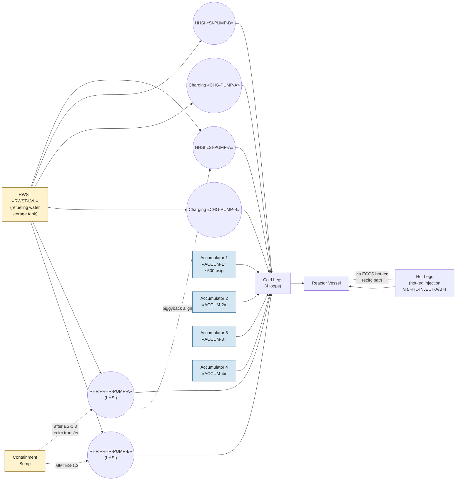

# Emergency Core Cooling System (ECCS)

The ECCS is the safety-grade complement of pumps, tanks, valves, and
piping that injects borated water into the RCS during accidents to
keep the core covered and the reactor subcritical. It is the system
that all of E-1 (LOCA), FR-C.x (core cooling), ECA-1.1 (recirculation
failure), and ES-1.3/1.4 (recirculation transfer) manage.

## Function

Provides emergency makeup and core cooling across the full LOCA
spectrum:

- High-head safety injection (HHSI) for small breaks where RCS pressure
  remains high
- Cold-leg accumulator (passive) injection for intermediate breaks
- Low-head safety injection (LHSI, via RHR) for large breaks at low
  RCS pressure
- Long-term recirculation from containment sump after RWST depletion

Per Vogtle UFSAR §6.3 design-basis analysis, ECCS keeps peak clad
temperature below the 10 CFR 50.46 limit (2200 °F) across the LOCA
spectrum with single-failure assumption.

## Components

- **Refueling water storage tank (RWST)** — borated-water source for
  initial injection, ~600,000 gallons (Vogtle Tech Spec 3.5.4).
- **Two high-head SI pumps (HHSI)** — «SI-PUMP-A», «SI-PUMP-B»;
  shutoff head ~1500 psig; high-pressure, low-flow regime.
- **Two charging pumps** — «CHG-PUMP-A», «CHG-PUMP-B»; positive-
  displacement, normally CVCS but realign to SI on accident signal.
- **Four cold-leg accumulators** — «ACCUM-1»..«ACCUM-4»; passive,
  nitrogen-pressurized to ~600 psig, discharge automatically when
  RCS pressure drops below tank pressure.
- **Two RHR (LHSI) pumps** — «RHR-PUMP-A», «RHR-PUMP-B»; shutoff head
  ~200 psig; high-flow, low-pressure regime; also serves shutdown
  cooling in Mode 4-5.
- **Containment recirculation sump** — long-term suction source after
  RWST depletion (post-Fukushima sump-strainer integrity reviewed in
  GSI-191).

## Instrumentation

- RWST level: «RWST-LVL» (low-low triggers automatic recirc-transfer initiation)
- Containment sump level: «CTMT-SUMP-LVL»
- Sump-strainer differential pressure: «SUMP-SCREEN-DP»
- SI signal (latched): «SI-SIG»
- SI header flow (high-head): «SI-FLOW»
- Low-head / RHR header flow: «LO-HEAD-FLOW»
- Accumulator discharge valve positions: «ACCUM-1»..«ACCUM-4»
- HHSI pump statuses: «SI-PUMP-A», «SI-PUMP-B»

## Setpoints

| Parameter | Value | Source |
|---|---|---|
| HHSI shutoff head (approximate) | 1500 psig | Vogtle UFSAR §6.3 |
| Accumulator nitrogen overpressure | 600 psig | Vogtle UFSAR §6.3.2 |
| LHSI shutoff head (approximate) | 200 psig | Vogtle UFSAR §6.3 |
| RWST low-low (recirc transfer initiate) | 38% indicated | Vogtle Tech Spec 3.5.4 |
| RWST normal volume | ~600,000 gal | Vogtle Tech Spec 3.5.4 |
| 10 CFR 50.46 peak clad temperature limit | 2200 °F | regulatory |

## Normal alignment

- HHSI pumps standby; suction aligned to RWST; discharge cold-leg
  injection valves CLOSED
- Charging pumps in service (normal CVCS), routinely cycled; SI
  alignment available on demand via realignment of suction/discharge
- Accumulator discharge valves OPEN, tank pressure ~600 psig, isolation
  valves OPEN
- RHR pumps standby (or in shutdown-cooling alignment in Mode 4-5)
- RWST level full (>90%)

## Failure modes

- **No SI flow despite running pumps** — flow-path blockage, sump
  strainer failure, mis-aligned valve. Inadequate-core-cooling
  response is [[FR-C.1]]; partial-degradation response is [[FR-C.2]].
- **HHSI cannot inject (RCS pressure exceeds shutoff head)** —
  depressurization via PORVs widens injection window; emergency
  feed-and-bleed if heat sink also lost. See [[FR-C.1]] step 3.
- **Recirculation transfer failure** — sump suction unavailable,
  pump trip during transfer, strainer blockage. Response [[ECA-1.1]].
- **LOCA outside containment (ISLOCA)** — ECCS injects into a path
  that bypasses containment, e.g. RHR V-sequence. Response [[ECA-1.2]].
- **Accumulator failure** — nitrogen leak (low pressure → won't
  discharge at the right pressure) or stuck discharge valve (no
  injection regardless of RCS pressure). LOCA performance degrades
  toward FR-C.x territory.

## References

- Vogtle UFSAR §6.3 (Emergency Core Cooling System)
- Vogtle UFSAR §6.3.2 (RWST, accumulators, recirculation)
- Vogtle UFSAR §15.6.5 (Loss of Reactor Coolant — Inadequate Core Cooling analysis)
- 10 CFR 50.46 (Peak clad temperature limit; ECCS performance criteria)
- NUREG-0737 II.F.2 (RVLIS + CETs — added post-TMI to monitor ECCS performance)
- NRC GSI-191 (containment sump-strainer integrity; addressed post-Fukushima)
