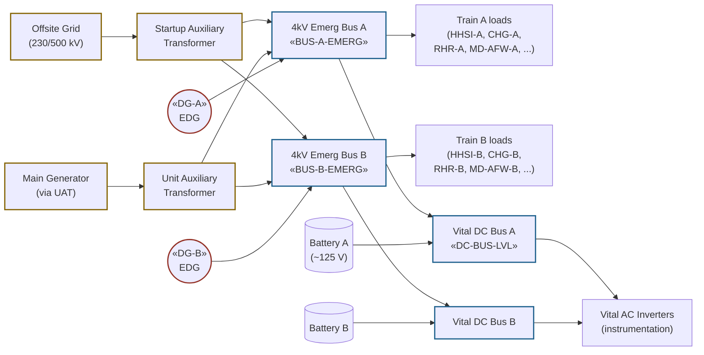

# Electrical Distribution (Class 1E AC + Vital DC)

The Class-1E electrical system supplies power to safety-related loads
during accidents. Two redundant trains (A and B), each fed from
offsite power, the unit's main turbine, or an emergency diesel
generator. Loss of all AC power coincident with offsite-power loss is
**station blackout** (SBO); response in [[ECA-0.0]]. Vital DC
batteries supply control and instrumentation power for the duration of
the SBO coping window.

## Function

Energizes Class-1E pumps, valves, and instrumentation under all design-
basis events. Loss of any single AC train must not preclude
mitigation; single-failure assumption is the design basis (Vogtle
UFSAR §8.3.1).

## Components

- **Two emergency diesel generators** — «DG-A», «DG-B»; each rated
  ~6500 kW (Vogtle); start automatically on undervoltage or SI;
  sequenced loading of safety loads over ~60 seconds.
- **Two 4kV emergency buses** — «BUS-A-EMERG», «BUS-B-EMERG»; one per
  train; supplied by either offsite source or own DG.
- **Two vital 125 V DC batteries** — sized for 4-hour SBO coping per
  10 CFR 50.63 (Vogtle), extendable via load-shed and FLEX
  (NEI 12-06).
- **Vital AC inverters** — DC-powered AC for instrumentation
  channels; surviving under SBO.
- **Offsite power sources** — typically two independent 230/500 kV
  lines from different switchyard buses.

## Instrumentation

- Emergency 4kV bus statuses: «BUS-A-EMERG», «BUS-B-EMERG»
- DG statuses: «DG-A», «DG-B»
- Vital DC bus voltage: «DC-BUS-LVL»

## Setpoints

| Parameter | Value | Source |
|---|---|---|
| DG start (undervoltage) | bus voltage < 75% nominal | Vogtle Tech Spec 3.3.5 |
| DG start (SI signal) | automatic with SI | Vogtle UFSAR §8.3.1.1 |
| DG load-sequence stagger | ~5-15 s per safety load | Vogtle UFSAR §8.3.1.1 |
| Battery LCO minimum | 70% capacity per 6-hour discharge | Vogtle Tech Spec 3.8.4 |
| SBO coping duration (Tech Spec) | 4 hours | 10 CFR 50.63 |
| FLEX extension target | 72 hours | NEI 12-06 / Order EA-12-049 |

## Normal alignment

- Both 4kV emergency buses energized from offsite via SAT
- DGs standby (in auto-start mode)
- Vital DC buses energized from battery chargers (AC-supplied);
  batteries floating
- Inverters supplying vital AC channels

## Failure modes

- **Loss of one bus / one train** — single-failure tolerated; other
  train carries safety loads. Cross-tie under SS authorization.
- **Loss of all AC (SBO)** — both DGs failed AND offsite power lost.
  TDAFW + DC instrumentation only. Response [[ECA-0.0]].
- **DG failure to start on demand** — common cause: fuel system,
  control logic. Single-failure assumption protects against one DG
  failure.
- **Battery depletion during prolonged SBO** — DC load-shed extends
  battery life; FLEX portable diesel restores AC.
- **RCP seal injection lost on SBO** — no charging without AC; seal
  cooling time ~5-10 min. Seal leakage becomes a small-break LOCA
  source under prolonged SBO.

## References

- Vogtle UFSAR §8.3 (Onsite power systems)
- Vogtle UFSAR §8.3.1.1 (Emergency diesel generators)
- Vogtle UFSAR §8.3.2 (Vital DC systems)
- Vogtle Tech Spec 3.3.5 (LOP/Undervoltage instrumentation), 3.8 (Electrical Power)
- 10 CFR 50.63 (Station Blackout Rule)
- NEI 12-06 (FLEX coping strategies)
- NRC Order EA-12-049 (post-Fukushima beyond-design-basis mitigating strategies)
