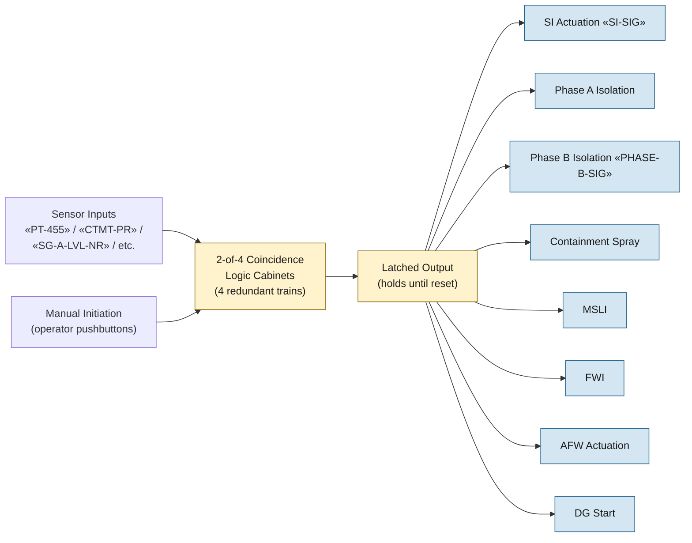

# Engineered Safety Features (ESF) Actuation

The ESF actuation system is the logic layer that aggregates accident-
detection signals (low pressurizer pressure, high containment pressure,
manual actuation, etc.) into actuated functions: SI, Phase A
containment isolation, Phase B containment isolation, containment
spray, MSLI, FWI, AFW initiation, and DG start. ESF outputs are
latched signals that hold their outputs until manually reset by the
operator.

## Function

Generates latched actuation signals on 2-of-4 coincidence logic from
sensor inputs. Each ESF signal drives a specific set of components to
their safety-protective positions:

- **Safety injection (SI)** «SI-SIG»: starts HHSI / charging in SI
  alignment / accumulator isolation valves OPEN / RHR ready
- **Phase A containment isolation**: closes non-essential containment
  penetrations (ventilation, sample lines, instrument air)
- **Phase B containment isolation** «PHASE-B-SIG»: closes all
  containment penetrations not required for accident mitigation
- **Containment spray**: starts spray pumps + sodium hydroxide additive
- **Main Steam Line Isolation (MSLI)**: closes all MSIVs
- **Feedwater Isolation (FWI)**: closes main feedwater isolation valves
- **AFW Actuation**: starts MD-AFW + TDAFW; opens AFW control valves
- **Emergency Diesel Generator (DG) start**: from undervoltage or SI
  signal

## Components

- **Solid-state protection system (SSPS)** — Westinghouse-style logic
  cabinets implementing the coincidence logic. Four redundant trains.
- **Manual ESF actuation pushbuttons** — main control board; can
  initiate each ESF function independently.
- **Master / Slave relays** — drive component-level actions per ESF
  signal.

## Setpoints (actuation thresholds)

| Signal | Setpoint | Source |
|---|---|---|
| SI on low pressurizer pressure | «PT-455» < 1815 psig | Vogtle Tech Spec 3.3.2 |
| SI on high containment pressure | «CTMT-PR» > 3 psig | Vogtle Tech Spec 3.3.2 |
| SI on low steam-line pressure | «SG-A-PR» < 600 psig (2/4 lines) | Vogtle Tech Spec 3.3.2 |
| Phase A on SI | automatic with SI | Vogtle UFSAR §6.2 |
| Phase B on high-high containment | «CTMT-PR» > 17 psig | Vogtle Tech Spec 3.3.2 |
| Containment spray | Same as Phase B | Vogtle Tech Spec 3.3.2 |
| MSLI on high steam flow + low Tavg | high flow on 1/4 line + low Tavg | Vogtle Tech Spec 3.3.2 |
| MSLI on low SG pressure | < 600 psig (2/4 lines) | Vogtle Tech Spec 3.3.2 |
| FWI on SI | automatic with SI | Vogtle UFSAR §10.4.7 |
| AFW on low-low SG level | < 17% NR on 2/4 SGs | Vogtle Tech Spec 3.3.2 |
| DG start on undervoltage | bus voltage < 75% nominal | Vogtle Tech Spec 3.3.5 |

## Normal alignment

- All bistable logic cabinets in service
- No ESF signals latched (all actuated outputs reset)
- Manual ESF pushbuttons available
- Master/slave relays in standby

## Failure modes

- **Single-channel failure** — 2-of-4 logic tolerates one bad
  channel; reduces to 1-of-3 for that signal
- **ESF actuation when not needed (spurious)** — common cause: sensor
  drift; can drive plant into accident response (SI initiation,
  containment isolation)
- **Failure to actuate on demand** — drives EOPs to verify automatic
  actions at E-0 steps 4 (SI), 6 (Phase A), 7 (MSL isolation), 8
  (FWI); manual initiation is the backup at each
- **Reset confusion** — ESF outputs latch until manually reset;
  premature reset before conditions clear can cause re-actuation

## References

- Vogtle UFSAR §7.3 (Engineered Safety Features Actuation System)
- Vogtle UFSAR §6.2 (Containment isolation logic)
- Vogtle Tech Spec 3.3.2 (ESF Instrumentation)
- NRC Westinghouse-style Technology Systems Manual, Chapter 14 (ESF)
