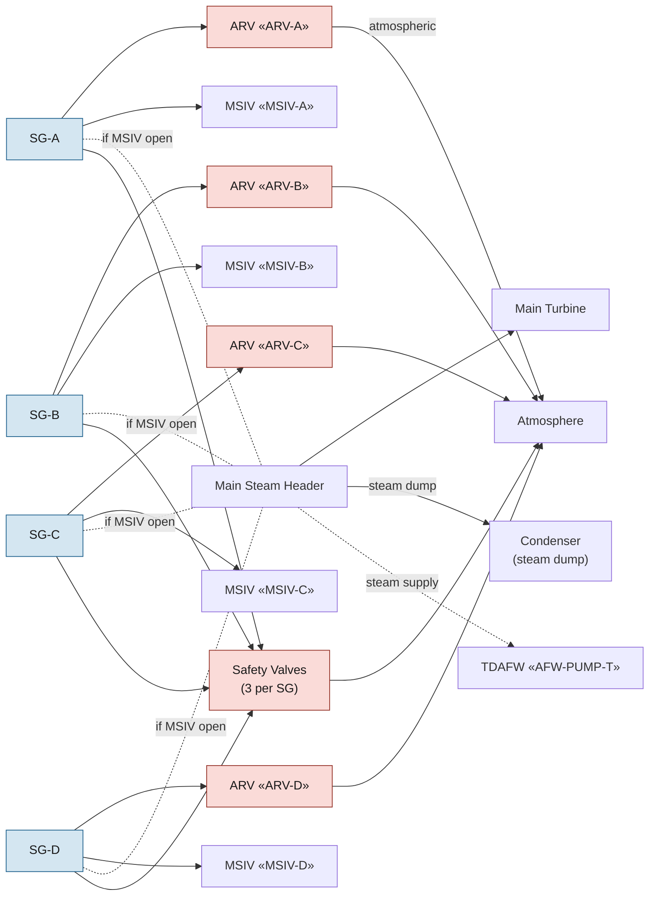

# Main Steam System (MSS)

The main steam system carries steam from the four SG outlets to the
main turbine; under accident conditions it carries steam to the
condenser dump valves (for cooldown), to atmospheric reliefs (when
condenser is unavailable), and to the TDAFW pump turbine. The MSIVs
are the boundary between containment-isolated and unisolated states
of the secondary side.

## Function

In normal operation: delivers ~14 million lb/hr of steam at ~1010 psig
(no-load) / 770 psig (full-load) to the main turbine. In emergency
operation: provides controlled heat removal from the RCS via SG steam
release to condenser, ARVs, or safety valves; carries TDAFW driving
steam under station blackout.

## Components

- **Four steam generators (SGs)** — see [[rcs]].
- **Four MSIVs** — «MSIV-A»..«MSIV-D»; close on Main Steam Line
  Isolation (MSLI) signal; air-operated, fail-closed.
- **Four atmospheric relief valves (ARVs)** — «ARV-A»..«ARV-D»;
  nitrogen-operated, fail-closed. Modulate for cooldown control when
  condenser is unavailable.
- **Twelve safety valves** — three per SG; spring-loaded, lift at
  staggered setpoints from ~1085 psig (Vogtle Tech Spec 3.7.1).
- **Main steam header** — connects all four SGs upstream of the MSIVs;
  steam-dump and TDAFW supplies tee off the header.
- **Condenser steam dump** — turbine-bypass valves modulate steam to
  the condenser under load rejection or cooldown.

## Instrumentation

- Per-SG steam pressure: «SG-A-PR», «SG-B-PR», «SG-C-PR», «SG-D-PR»
- Main steam header pressure: «MS-HEADER-PR»
- N-16 monitors (SGTR detection): «SG-A-N16», «SG-B-N16», «SG-C-N16», «SG-D-N16»
- Per-MSIV position: «MSIV-A», «MSIV-B», «MSIV-C», «MSIV-D»
- Per-ARV position: «ARV-A», «ARV-B», «ARV-C», «ARV-D»
- ARV nitrogen-supply pressure: «N2-SUPPLY»
- Steam-dump availability: «STEAM-DUMP»
- Condenser vacuum: «CONDENSER-VAC»
- Condenser air-ejector activity: «AEJ-RAD»

## Setpoints

| Parameter | Value | Source |
|---|---|---|
| Safety valve lift (lowest setpoint) | 1085 psig | Vogtle Tech Spec 3.7.1 |
| MSLI trip | Low steam-line pressure 600 psig | Vogtle Tech Spec 3.3.2 |
| ARV control band (no-load) | ~1010 psig | Vogtle UFSAR §10.3.2 |
| MSL break flow trip | High steam flow + low Tavg | Vogtle Tech Spec 3.3.2 |
| Tech Spec cooldown rate | ≤100 °F/hr below 350 °F | Vogtle Tech Spec 3.4.3 |

## Normal alignment

- All four MSIVs OPEN; steam flowing to turbine through bypass valves
  during startup, through turbine-stop valves at power
- ARVs CLOSED; nitrogen supply pressurized
- Condenser vacuum drawn (~26-28 inHg), steam-dump valves available
- Safety valves on standby (lift only at setpoint)

## Failure modes

- **Faulted SG (steam line break, FW line break inside containment)** —
  rapid SG depressurization on a single SG. Diagnosed at [[E-0]] step
  15; managed by [[E-2]].
- **Uncontrolled depressurization of all SGs** — main steam header
  break upstream of MSIVs, common-cause MSIV failure. Response
  [[ECA-2.1]].
- **SG overpressure (relief failed)** — ARV unresponsive AND
  safety-valve stuck. Response [[FR-H.2]].
- **Loss of condenser dump** — condenser vacuum lost, dump valves
  isolated. ARV becomes the only release path. Response [[FR-H.4]].
- **MSIV will not close on demand** — strong indicator of faulted SG
  (per E-0 step 7 Caution). E-2 isolation path may be impaired.
- **SGTR** — N-16 monitor elevated on the ruptured SG; main steam
  flow carries fission gases. Response [[E-3]].

## References

- Vogtle UFSAR §10.3 (Main Steam Supply System)
- Vogtle UFSAR §10.3.2 (MSIVs and ARVs)
- Vogtle UFSAR §10.4.4 (Condenser steam dump)
- Vogtle Tech Spec 3.3.2 (MSLI logic), 3.7.1 (safety-valve setpoints),
  3.4.3 (cooldown rate limit)
- Vogtle UFSAR §15.1.5 (Steam-system piping failure analysis)
