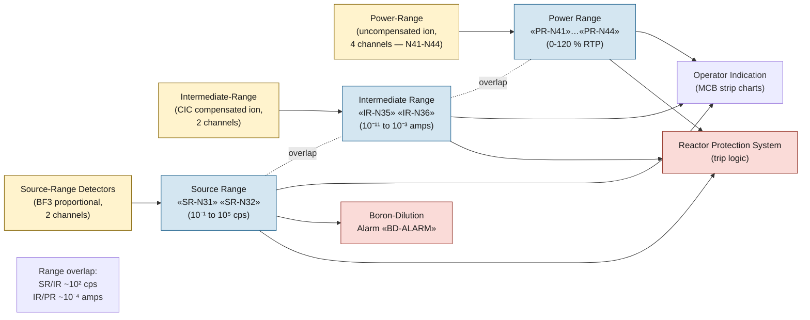

# Nuclear Instrumentation System (NIS)

NIS measures neutron flux across roughly ten decades, from shutdown
source levels to ~120 % rated thermal power. Three overlapping
detector ranges (source, intermediate, power) feed both the reactor
protection system and the operator indications used in E-0, FR-S.1,
and shutdown-margin verification.

## Function

Provides flux indication from shutdown to full power, with overlap
between adjacent ranges so the operator never loses a flux reading
during reactor startup or shutdown. Source-range counts feed the
boron-dilution alarm and the FR-S.2 dilution-detection criterion.
Power-range channels feed the high-flux trip, the overpower-ΔT trip,
and rod-deviation surveillance.

## Components

- **Source-range detectors** — two BF3 proportional counters; located
  ex-core; sensitive in shutdown and approach-to-critical regime;
  output as counts per second.
- **Intermediate-range detectors** — two compensated ion chambers
  (CIC); cover from ~10⁻¹¹ to ~10⁻³ amps DC current; overlap source
  range at the low end and power range at the high end.
- **Power-range detectors** — four uncompensated ion chambers, top
  and bottom sections (axial flux shape); channels N41–N44; feed the
  high-flux trip, overpower-ΔT, and axial-flux-difference (AFD)
  monitoring.
- **Detector wells** — ex-core, in the bioshield annulus around the
  reactor vessel; positions chosen for flux response and access.
- **Drawer electronics** — signal processing, range-overlap logic,
  trip bistables; located in instrument racks; drive RPS coincidence.

## Instrumentation

- Source-range channels: «SR-N31», «SR-N32»
- Intermediate-range channels: «IR-N35», «IR-N36»
- Power-range channels: «PR-N41», «PR-N42», «PR-N43», «PR-N44»
- Boron-dilution alarm: «BD-ALARM»
- Axial flux difference: «AFD»
- Wide-range flux indication (composite): «WR-FLUX»

## Setpoints

| Parameter | Value | Source |
|---|---|---|
| Source-range high flux trip (block above P-6) | configurable; nominal 10⁵ cps | Vogtle Tech Spec 3.3.1 |
| Intermediate-range high flux trip (block above P-10) | 25% RTP equivalent | Vogtle Tech Spec 3.3.1 |
| Power-range neutron flux — high trip | 109% RTP | Vogtle Tech Spec 3.3.1 |
| Power-range neutron flux — high rate trip | 5% RTP per second | Vogtle Tech Spec 3.3.1 |
| Overpower-ΔT trip | per Tech Spec equation | Vogtle Tech Spec 3.3.1 |
| Boron-dilution alarm | source-range count rate ×2 over baseline | Vogtle UFSAR §15.4.6 |
| AFD operating band | ±5% from target | Vogtle Tech Spec 3.2.3 |

## Normal alignment

- All ten channels in service; no bypassed channels
- Source-range trip blocked above P-6 (intermediate-range threshold)
- Intermediate-range trip blocked above P-10 (power-range threshold)
- Power-range trips active
- AFD within Tech Spec band

## Failure modes

- **Single-channel inoperability** — 2-of-4 logic for power range
  tolerates one bad channel; Tech Spec LCO entered (typically 72 h)
- **Detector saturation in source range during shutdown** — gamma
  background can lift counts above source-range baseline; consult
  reactor engineering for interpretation
- **Loss of source-range indication during dilution** — FR-S.2
  cannot rely solely on source-range; boron sample is the verification
- **Stuck power-range channel** — drives rod-deviation alarm;
  surveillance per Tech Spec; bypass requires SS authorization
- **AFD outside band** — penalty entered into core operating limits;
  may require power reduction per Tech Spec

## References

- Vogtle UFSAR §7.2 (Reactor Trip System)
- Vogtle UFSAR §7.7.1.7 (NIS — nuclear instrumentation)
- Vogtle Tech Spec 3.3.1 (RPS Instrumentation)
- Vogtle Tech Spec 3.2.3 (Axial Flux Difference)
- NRC Westinghouse-style Technology Systems Manual, Chapter 6 (NIS)
