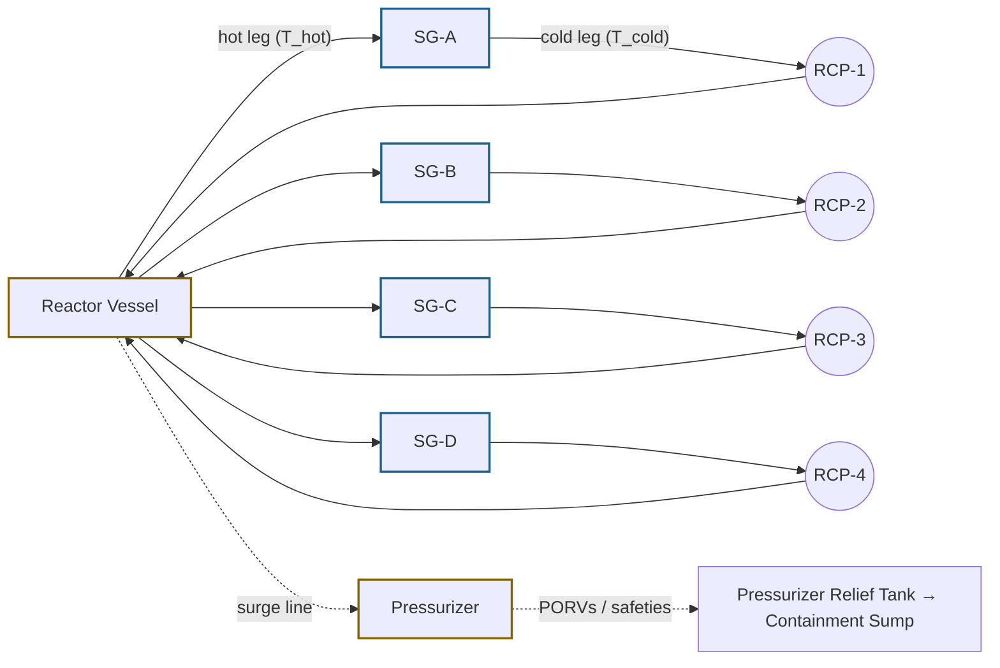
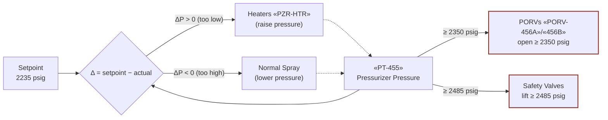

# Reactor Coolant System (RCS)

The reactor coolant system is the primary pressure boundary and heat-
transfer loop between the reactor core and the four steam generators.
In normal operation it carries decay heat and fission energy out of the
core and into the SGs at high pressure (~2235 psig) and bulk temperature
(~547 °F Tavg per Vogtle Tech Spec Mode 3); in emergency operation it
is the system that every E-, ES-, ECA-series procedure manages.

## Function

Transfers reactor decay heat and full-power fission energy from the
core to the steam generators while maintaining adequate subcooling
margin at the core exit, controlled RCS pressure within the
pressure-temperature limit curves, and inventory sufficient to keep
the core covered. After a reactor trip the RCS continues to remove
decay heat — initially at ~7% of rated thermal power, decaying through
~1% by one hour post-trip per ANS-5.1 decay-heat correlations.

## Components

Primary-loop topology (one of four identical loops shown explicitly;
the other three are abbreviated):

- **Reactor vessel** — Westinghouse-style 4-loop design, cylindrical
  carbon-steel shell with stainless-steel cladding on internal surfaces.
  Vogtle: Combustion-Engineering-fabricated.
- **Pressurizer** — connected to one of the hot legs via a surge line;
  carries a steam bubble above borated water; controls RCS pressure via
  heaters, normal/auxiliary spray, and PORVs / safeties.
- **Four reactor coolant pumps (RCPs)** — one per loop, vertical
  centrifugal, ~88,000 gpm each at rated speed.
- **Four steam generators (SGs)** — vertical U-tube design, ~5,800
  tubes each, ~33-ft height; primary side on the tube side, secondary
  side on the shell side.
- **Pressurizer relief valves** — two power-operated relief valves
  («PORV-456A», «PORV-456B») with block valves; three spring-loaded
  safety valves (Vogtle Tech Spec 3.4.10).

## Instrumentation

- Pressurizer pressure: «PT-455» (wide range)
- Pressurizer level: «PZR-LVL»
- Hot-leg temperatures: «TE-411-HOT» / «TE-421-HOT» / «TE-431-HOT» / «TE-441-HOT»
- Cold-leg temperatures: «TE-411-COLD» / «TE-421-COLD» / «TE-431-COLD» / «TE-441-COLD»
- RCS Tavg (4-loop average): «TAVG»
- Subcooling margin (computed): «SUB-MARGIN»
- Core-exit thermocouples: «CET-AVG» (post-TMI NUREG-0737 II.F.2)
- Reactor vessel level indication: «RVLS-DYN» (RVLIS dynamic-pressure-compensated channel)

## Setpoints

| Parameter | Value | Source |
|---|---|---|
| Normal operating pressure | 2235 psig | Vogtle UFSAR §5.1.1 |
| Tavg no-load (Mode 3) | 547 °F | Vogtle Tech Spec 1.0 |
| Subcooling margin threshold for RCP trip | 30 °F | Vogtle UFSAR §15.6 |
| Cooldown rate limit (≤350 °F) | 100 °F/hr | Vogtle Tech Spec 3.4.3 |
| Heatup rate limit | 100 °F/hr | Vogtle Tech Spec 3.4.3 |
| Cold shutdown Mode 5 | T_cold ≤ 200 °F, P_RCS < 50 psig | Vogtle Tech Spec 1.0 |

PTS limit curve (P-T limits, heatup and cooldown) is plant- and
cycle-specific; for Vogtle see Tech Spec 3.4.3 figures with RTNDT
shift for end-of-life vessel embrittlement.

Pressurizer pressure-control feedback (closed-loop in normal
operation; PORVs and safeties as overrides):

## Normal alignment

- All four RCPs running (forced convection, ~352,000 gpm total flow)
- Pressurizer level controlled at programmed value (~50% at Mode 1, ~25% at Mode 3)
- Charging «CHG-FLOW» balanced against letdown «LET-FLOW» (~75 gpm each)
- PORVs and block valves: PORVs closed, block valves OPEN (relief path available)
- Pressurizer heaters cycling to maintain pressure setpoint

## Failure modes

- **Loss-of-coolant accident (LOCA)** — break in primary pressure
  boundary. Diagnosed at [[E-0]] step 4 (LOCA symptoms); managed by
  [[E-1]]. Special cases: [[ECA-1.1]] (recirculation failure),
  [[ECA-1.2]] (LOCA outside containment).
- **Steam generator tube rupture (SGTR)** — primary-to-secondary leak
  through SG tube. Diagnosed at [[E-0]] step 16; managed by [[E-3]].
- **Inadequate core cooling** — core exit thermocouples saturated /
  superheated, vessel level low. Function-restoration response in
  [[FR-C.1]].
- **Pressurized thermal shock (PTS)** — pressure-temperature trajectory
  crosses limit curve. Responses [[FR-P.1]] (imminent) and [[FR-P.2]]
  (anticipated).
- **RCS overpressure** — pressurizer relief valve failures, undetected
  charging-letdown imbalance, or boron-dilution-driven cold injection
  with simultaneous heatup. Pressurizer PORVs lift at ~2350 psig,
  safety valves at ~2485 psig per Vogtle Tech Spec 3.4.10.
- **Voiding in upper head** — natural-circulation flow stagnation,
  inadequate makeup during depressurization. Response [[FR-I.3]].

## References

- Vogtle UFSAR §5.1 (Reactor Coolant System summary)
- Vogtle UFSAR §5.4 (Reactor Coolant System Components — pressurizer, PORVs, RCPs)
- Vogtle UFSAR §15.6 (Decrease in Reactor Coolant Inventory)
- NRC Westinghouse-style Technology Systems Manual, Chapter 4 (NSSS Overview)
- NUREG-0737 II.F.2 (post-TMI instrumentation requirements: CETs + RVLIS)
- Todreas & Kazimi, *Nuclear Systems Vol. I*, Chapter 1 (PWR primary-loop thermal-hydraulics)
