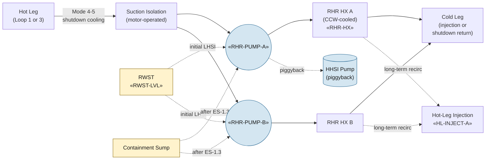

# Residual Heat Removal System (RHR)

RHR has two distinct operating modes: (1) shutdown cooling in Modes
4-5, removing decay heat from the RCS at low pressure to take the
plant to refueling temperature; and (2) low-head safety injection
(LHSI) during a LOCA, including the long-term cold-leg and hot-leg
recirculation path after RWST depletion.

## Function

In shutdown cooling: suction from one hot leg, discharge through RHR
heat exchanger (cooled by component cooling water), return to cold
legs. Brings the RCS from RHR cut-in conditions (Mode 4, ~350 °F,
~390 psig) down to Mode 5 conditions for refueling.

In LHSI / recirculation: provides low-pressure ECCS flow from the
RWST initially, then from the containment sump after [[ES-1.3]]
recirculation transfer; in piggyback alignment supplies high-head SI
pump suction during long-term recirculation.

## Components

- **Two RHR pumps** — «RHR-PUMP-A», «RHR-PUMP-B»; centrifugal,
  ~4500 gpm each at low head.
- **Two RHR heat exchangers** — shell-and-tube; tube side carries RCS
  flow, shell side carries component cooling water (CCW).
- **Hot-leg suction isolation valves** — motor-operated, interlock
  with RCS pressure (cannot open above ~400 psig per Tech Spec to
  prevent overpressurization of the low-pressure RHR piping).
- **Crossties** — to high-head SI suction for piggyback recirculation
  alignment; to containment-spray header for alternate spray suction
  in some configurations.

## Instrumentation

- RHR pump statuses: «RHR-PUMP-A», «RHR-PUMP-B»
- Low-head header flow: «LO-HEAD-FLOW»
- RHR heat-exchanger outlet temperature (representative): «RHR-HX»
- Suction-source alignment (RWST vs sump): typically two-valve indication

## Setpoints

| Parameter | Value | Source |
|---|---|---|
| RHR cut-in temperature (Mode 4) | ≤ 350 °F | Vogtle Tech Spec 1.0 |
| RHR cut-in pressure | ≤ 390 psig | Vogtle Tech Spec 3.4.6 |
| Hot-leg suction valve interlock | Closes if RCS pressure > 400 psig | Vogtle UFSAR §5.4.7 |
| LHSI shutoff head (approximate) | 200 psig | Vogtle UFSAR §6.3 |
| RHR pump NPSH (sump suction) | per pump curve + sump strainer DP | Vogtle UFSAR §6.3.2 |

## Normal alignment

In Modes 1-3 (at-power and hot standby):

- Both RHR pumps standby; suction aligned to RWST
- Hot-leg suction isolation valves CLOSED (interlock at RCS pressure)
- Cold-leg discharge valves CLOSED; ready for SI on actuation signal

In Modes 4-5 (shutdown cooling):

- One or both RHR pumps running; suction on hot leg (loop 1 or 3)
- Discharge to cold legs through RHR HX
- CCW supplying HX shell side

## Failure modes

- **Recirculation transfer failure** — pump trip, sump suction
  blockage, valve failure. Response [[ECA-1.1]].
- **Loss of RHR in Mode 4-5** — pump trip during shutdown cooling
  drives RCS heatup; alternate decay-heat removal via SG steam dump
  may be needed.
- **Sump strainer blockage** — debris from LOCA insulation in
  containment; addresses GSI-191; if DP rises during recirc, pump
  cavitation risk.
- **Hot-leg suction valve fails to close on RCS repressurization** —
  overpressurizes the low-pressure RHR piping; Tech Spec interlock
  required.

## References

- Vogtle UFSAR §5.4.7 (Residual Heat Removal System)
- Vogtle UFSAR §6.3.2 (RHR as LHSI; recirculation sequence)
- Vogtle Tech Spec 3.4.6 (RHR loops — Mode 4)
- Vogtle Tech Spec 3.5.5 (RHR ECCS — Modes 1-3)
- NRC GSI-191 (sump strainer integrity)
