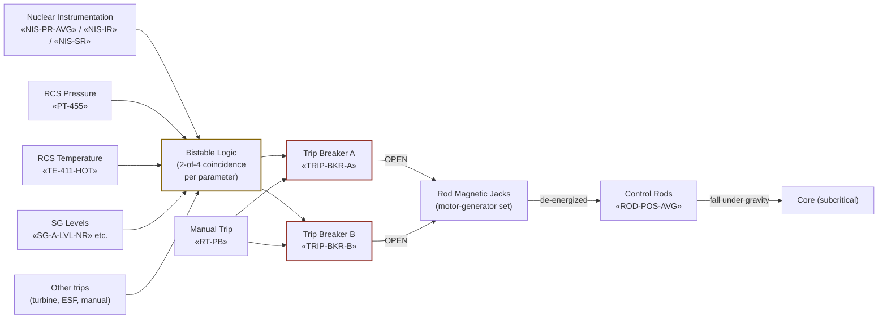

# Reactor Protection System (RPS)

The reactor protection system monitors plant parameters and trips the
reactor when any monitored condition exceeds its safety setpoint.
Failure of RPS to trip on demand is **ATWS** (Anticipated Transient
Without Scram); the response is in [[FR-S.1]]. The 10 CFR 50.62
AMSAC backup is independent of RPS and is required as an ATWS
mitigation.

## Function

Generates a reactor trip signal that opens the reactor trip breakers,
de-energizes the rod-control magnetic jacks, and drops all control rods
into the core under gravity within ~2.2 seconds. Trip signals come from
~20 different parameter channels organized in 2-of-4 coincidence logic.

## Components

- **Reactor trip breakers** — «TRIP-BKR-A», «TRIP-BKR-B»; two in series
  in the rod-control power feed. Opening either de-energizes the rod
  magnetic jacks.
- **Bistable logic cabinets** — 4 redundant trains; each generates trip
  signals from sensor inputs.
- **Manual trip pushbuttons** — «RT-PB»; two on the main control board.
- **Rod-control magnetic jacks** — energized continuously during
  operation; de-energizing drops the rods.
- **Source-range / intermediate-range / power-range neutron detectors**
  — «NIS-SR», «NIS-IR», «NIS-PR-AVG».

## Instrumentation

- Trip breaker positions: «TRIP-BKR-A», «TRIP-BKR-B»
- Manual trip pushbutton state: «RT-PB»
- Reactor power (4-channel power-range): «NIS-PR-AVG»
- Intermediate range: «NIS-IR»
- Source range count rate: «NIS-SR»
- Average rod bottom position: «ROD-POS-AVG»

## Setpoints

| Trip parameter | Setpoint | Source |
|---|---|---|
| High power (Power range) | 109% rated | Vogtle Tech Spec 3.3.1 |
| Overtemperature ΔT (OTΔT) | f(T_avg, P_RCS) | Vogtle Tech Spec 3.3.1 |
| Overpower ΔT (OPΔT) | f(T_avg) | Vogtle Tech Spec 3.3.1 |
| Low RCS flow | 90% nominal in 2/4 loops | Vogtle Tech Spec 3.3.1 |
| Low pressurizer pressure | 1865 psig | Vogtle Tech Spec 3.3.1 |
| Low-low SG level | ~17% NR on 2/4 SGs | Vogtle Tech Spec 3.3.1 |
| Manual trip | depress both «RT-PB» | always available |
| Rod drop response | ≤ 2.2 s to full insertion | Vogtle UFSAR §15.4 |

## Normal alignment

- All bistable cabinets in service; trip-permissive logic at power
- Both trip breakers CLOSED, rod-control power energized
- Manual trip pushbuttons enabled (not bypassed)
- Source range high-flux trip bypassed above P-6 (intermediate-range
  permissive); intermediate-range trip bypassed above P-10 (power-range
  permissive)

## Failure modes

- **Failure to trip on demand (ATWS)** — bistables fail OR breakers
  fail to open. Response [[FR-S.1]]; AMSAC provides backup turbine
  trip + AFW initiation on independent logic.
- **Spurious trip** — single-channel failure exceeding bistable
  threshold without real plant condition. Two-of-four coincidence
  reduces but doesn't eliminate spurious trips.
- **Loss of shutdown margin (post-trip)** — boron dilution or xenon
  decay drives reactor toward criticality despite all rods inserted.
  Response [[FR-S.2]].
- **Inadvertent rod insertion** — rod-control system malfunction. Can
  challenge axial flux distribution; managed by Operations procedures
  (not an EOP).

## References

- Vogtle UFSAR §7.2 (Reactor Trip System)
- Vogtle Tech Spec 3.3.1 (RPS Instrumentation)
- Vogtle UFSAR §15.4.9 (ATWS analysis)
- 10 CFR 50.62 (AMSAC ATWS mitigation requirements)
- NRC Westinghouse-style Technology Systems Manual, Chapter 12 (RPS)
